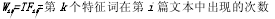
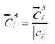

<!-- ---
title: 文本分类综述
date: 2016-12-03 
tags: 算法, 文本分类
--- -->

　　文本分类是一项系统的工程，所涉及的技术很多，按流程可以将文本分类分为:文本预处理阶段、训练阶段、分类阶段、评价四个阶段，其中预处理阶段要文本处理成计算机能识别的格式，首先对文本进行分词处理，中文文本和英文文本组织形式不同，中文文本的分词过程比英文分词要复杂得多。分词后文本的特征词非常多，而我们需要的只是少数有使用价值的特征词，因此分词后的文本要进行特征选择，并将特征选择后的特征项加权，最后将文本表示成向量空间模型(VSM)，经过预处理后的文本才能进行分类。分类算法是文本分类的核心技术。评估阶段是对文本分类的效果进行评价，常用的指标有:准确率、召回率、以及综合这两个指标的评价方法一F1值等。

### 文档表示方法

　　文档集划分为训练集和测试集两个部分，训练集用于分类模型的学习，一般占整个文档集的70%;测试集用于评价分类模型，一般占整个文档集的30%。开放的英文文档集Reuters-21578和20NewsGroups。前者比后者更为常用。

　　经过半个世纪的发展，在文本处理领域，研究者提出了一些文本表示模型，主要有：布尔模型、向量空间模型、概率检索模型、n-Gram模型等，其中使用最广、效果最好的是向量空间模型。

**向量空间模型**

　　20世纪60年代，Salton G等人提出了向量空间模型，并成功应用于SMART文本检索系统，其基本思想是:将文本表征成由特征项(词)构成的向量空间中的一个点，（W1,W2,…,Wi），其中Wi为第i个特征项的权重，然后通过计算空间两点之间的相似度来表示两个文本的相关程度，相似度计算一般采用欧氏距离或向量夹角的余弦值。向量空间模型在实际使用中取得了很好的效果，常用的文本分类算法中，支持向量机、K近邻、和NB都是基于向量空间模型的。

**布尔模型**

　　布尔模型可以看作是向量模型的一种特例，根据特征是否在文档中出现，特征的权值只能取1或0。许多时候，使用二值特征的分类效果结果并不比考虑特征频率的差。决策树方法、关联规则方法和Boosting方法就是基于布尔模型。

**概率模型**

　　我们可以用该流程的思想来解决出现在文档检索中的不确定性和找寻的不清楚性。概率模型的理论是基于概率排队的：如果文件是按相关概率递减方向排队时，那么就会出现最大的检索性能。选用此种模型可以克服BM和SVM中的不足，此种模型根据词与词间和文档间与词条的概率关联性进行搜索。设文档d和顾客查询c都用（a1,a2,…an）表示，当词条ti∈d时，有ai=1.否则ai=0,这种关系可数学表示为：

其中

　　f是所有参加训练的文档的总和，r则为顾客查询与文档集中相关的文档数，fi则表示训练文档集中有ti的文档数，ri则表示r个相关文档中有ti的文档数，模型的有点是有着非常严谨的数学理论基础，解决了不确定性推理的缺点，但是它的不足在于参数估计方面很困难，在文件和查询的表达方面也是很困难

### 文档分词

　　词是文本中最小的具有意义的语言成分，是构造向量空间模型的基础，文本分词的效果直接影响到文本分类的结果。在文本的组织上，中文与以英语为代表的欧美语言有着很大的不同，在西方语言中，词与词是使用空格隔开的，因此不需要进行分词处理，而在中文文本中，字、词是连在一起的，一个语句就是一连串的字、词组合，词与词之间没有明显界限，因此，分词的难度较大。常用的分词算法主要有:基于词典的分词方法、基于理解的分词方法、基于统计的分词方法。

**基于词典的分词方法**   

　　基于词典的分词方法又叫做机械分词方法，它是按照一定的策略将待切分的字符串与词典中的词条进行匹配，若在词典中找到某个字符串，则匹配成功(即识别出一个词)。按照扫描方向的不同，基于词典的分词方法可以分为正向匹配和逆向匹配;按照不同长度优先匹配的情况，可以分为最大匹配和最小匹配;按照是否与词性标注过程相结合，又可以分为单纯分词方法和分词与标注相结合的一体化方法，常用的几种基于词典分词方法如下:正向最大匹配法(由左到右的方向)、逆向最大匹配法(由右到左的方向)、逐词遍历法。

　　在实际应用中，常常将上述方法结合起来。例如，可以将正向最大匹配方法和逆向最大匹配方法结合起来构成双向匹配法。由于汉语单字成词的特点，正向最小匹配和逆向最小匹配一般很少使用。一般说来，逆向匹配的切分精度略高于正向匹配，遇到的歧义现象也较少。

　　再一种方法是改进扫描方式，称为特征扫描或标志切分，优先在待分析字符串中识别和切分出一些带有明显特征的词，以这些词作为断点，可将原字符串分为较小的串再来进行机械分词，从而减少匹配的错误率。还有一种方法是将分词和词类标注结合起来，利用丰富的词类信息对分词决策提供帮助，并且在标注过程中又反过来对分词结果进行检验、调整，从而极大地提高切分的准确率。目前实用的自动分词系统基本上都是以采用机械分词为主，辅以少量的词法、语法和语义信息的分词系统。该方法的优点是易于实现，但精度较低，远远不能满足实际的需要。实际使用的分词系统，都是把机械分词作为一种初分手段，再利用各种其它的语言信息来进一步提高切分的准确率。

**基于理解的分词方法**

　　又称人工智能分词法，这种分词方法是通过让计算机模拟人对句子的理解，达到识别词的效果。其基本思想就是在分词的同时进行句法、语义分析，利用句法信息和语义信息来处理歧义现象。它通常包括三个部分:分词子系统、句法语义子系统、总控部分。在总控部分的协调下，分词子系统可以获得有关词、句子等的句法和语义信息来对分词歧义进行判断，即它模拟了人对句子的理解过程。这种分词方法需要使用大量的语言知识和信息。由于汉语语言知识的笼统、复杂性，难以将各种语言信息组织成机器可直接读取的形式，因此目前基于理解的分词系统还处在试验阶段。   

**基于统计的分词方法**

　　基于统计的分词算法的思想是:找出输入字符串的所有可能的切分结果，对每种切分结果利用能够反映语言特征的统计数据计算它的出现概率，然后从结果中选取概率最大的一种。词是稳定的字的组合，因此在上下文中，如果相邻的字共现的次数越多，就越有可能构成一个词。因此字与字相邻出现的频率或概率能够较好的反映成词的可信度。通过对语料中相邻共现的各个字的组合频度进行统计，计算它们的互现信息。互现信息体现了汉字之间结合关系的紧密程度。当紧密程度高于某一个阈值时，便可认为此字组可能构成了一个词。这种方法只需对语料中的字组频度进行统计，不需要切分词典，因而又叫做无词典分词法或统计取词方法。但这种方法也有一定的局限性，会经常抽出一些共现频度高、但并不是词的常用字组，并且对常用词的识别精度差，时空开销大。实际应用的统计分词系统都要使用一部基本的分词词典进行串匹配分词，同时使用统计方法识别一些新的词，即将串频统计和串匹配结合起来，既发挥匹配分词切分速度快、效率高的特点，又利用了无词典分词结合上下文识别生词、自动消除歧义的优点。
    
　　对于任何一个成熟的中文分词系统来说，不可能单独依靠某一种算法来实现，需要
综合不同的算法来处理不同的问题。

### 停用词处理技术

　　经过分词处理的文本，并不是所有的特征都对构造向量空间模型和分类有帮助，相反，将对文本分类没有帮助的词作为特征项，会对分类的精度造成很大的影响，特别对于使用文档频率(DF)进行特征选择的分类方法，影响更大。另外，去停用词可以很大程度上减小特征项的数量，对文本降维具有很大帮助，所以在构造向量空间模型前，要对分类无帮助的词进行尽可能彻底的清理。去停用词在技术上实现并不复杂，只需建立一个停用词词典停用词词典内的词条进行匹配，如果匹配成功，则将该词去掉。

### 特征选择方法
　
　　在经过文本分类系统的分词、去停用词处理后，文本的特征维数仍然很高，这里所指的特征维数是指要构造VSM空间的所有文本的特征之和，一个文本集合很可能包含十几万个特征词，而每篇文本包含的特征词却很少，这样构造的向量空间模型是一个高维的稀疏矩阵，会对分类算法的时间复杂度和空间复杂度造成很大的影响。实验显示，当向量空间的特征维度达到一定值时就可以实现很高的分类性能，随着特征维度的增加，分类性能反而会下降。因此，必须对特征项进行有效的筛选。常用的文本特征选择方法有:文档频率(DF)、信息增益(IG)、互信息(MI)、X2统计量(CHI)、期望交叉嫡等，这些方法的基本思想都是对每一个特征(在这里是中文词)，计算某种统计度量值，然后设定一个阈值T，把度量值小于T的那些特征过滤掉，剩下的即认为是有效特征。

**文档频率（DF）**

　　DF值低于某个阈值的词条是低频词，它们不含或含有较少的类别信息。将这样的词条从原始特征空间中移除，不但能够降低特征空间的维数，而且还有可能提高分类的精度。DF高于某个阈值的词为中、高频词，这些词被认为对分类的影响较大，应该保留。在英文环境中，当IG和CHI等统计方法的计算复杂度太高时，DF可以代替它们被使用。

**互信息（MI）**

　　如果用A表示包含词条t且属于类别c的文档频数，B为包含t但不属于c的文档频数，C表示属于c但是不包含t的文档频数，N表示语料中的文档总数，t和c的互信息由下式计算：

 
如果t和c无关（即P(tc)=P(t)*P(c)），I(t,c)值自然为零。为了将互信息应用于多个类别，由下式计算t对于c的互信息：

其中m为类别数，将低于特定阈值的词条从原始特征空间中移除，降低特征空间的维数，保留高于阈值的词条

**信息增益（IG）**

　　表示文档包含某一特征时文档类的平均信息量，定义为某一特征在文档中出现前后的信息熵之差。假定c为文本类变量，C为文本类的集合，d为文本，f为特征。对于特征f其信息增益记为IG(f)，计算公式

**X2统计（CHI）**

　　CHI统计方法度量词条t和文档类别c之间的相关程度，并假设t和c之间符合具有一阶自由度的x2分布，词条对于某类的x2统计值越高，它与类之间的相关性越大，携带的类别信息也较多，令N表示训练语料中的文档总数，c为某一特定类别，t表示特定的词条，A表示属于c类且包含t的文档频数，B表示不属于c类但包含t的文档频数，C表示属于c类但不包含t的文档频数，D表示既不属于c也不包含t的文档频数，则t对于c的CHI值计算公式：

对于多类问题，分别计算t对于每个类别的CHI值，可以用下面两种标准计算t对整个训练集的CHI：

其中m为类别数，从原始特征空间中移除低于特定阈值的词条，保留高于该阈值的词条作为文档表示的特征

### 特征权重计算方法

**布尔权重**

　　均权，布尔权重是最最简单的一种赋权方法，这种方法将所有特征同等看待，既不突出又不抑制任何一个特征。特征项的权值或者等于1，或者等于0,计算公式为:

 
其中Wi为特征项i的权重，TF为特征项i出现的次数，这种方法的缺点就是无法体现一个词在文本中的重要程度。

**TF权重**

　　TF权重(Term Frequency)又称词频权重，或称特征项频率。不同类别的文档，在特征项的出现频率上有很大差异，因此特征项频率信息是文本分类的重要参考之一，一般较大的特征项在该类文档中具有较高的权重。它的计算公式为:

　　实际应用中各类别文本的长度很难一致，各类文本包含的字数、词数可能差别会很大，这对词频会造成直接影响，因此通常对词频作归一化处理。另外，如果特征选择后的特征项中含有较多的非名词(如代词、数词、连词)，而这些词出现的概率非常高，如果使用TF权重加权，会赋值给这些词较高的权重，这势必对分类结果产生不利影响，因此，TF权重对去停用词的效果具有较强依赖性。

**IDF权重**

　　IDF越大，此特征项在文档中的的分布越集中，说明它在区分该文档内容属性方面的能力越强。反文档频率是特征项在文档集分布情况的量化。该方法以出现特征词的文本数为参数构建的函数代表特征项的权重。这体现了信息论中集中度的思想，具有一定的合理性，但忽略了分散度和频度两个因素，因此具有片面性，公式如下:

**TFIDF权重**

　　TFIDF(Term Frequency-Inverse Document Frequency)是由是由Salton在1988年提出的，TFIDF权重综合考虑了TF权重和IFD权重的优点和不足，是目前加权效果最好的权重计算方法，广泛应用于文本处理领域。其基本思想是:如果特征项t在一类文档的出现的次数越多，而在整个文档集中出现的频率越低，那么t对分类的作用越大，应该赋予越高的权重，例如，助词“的”几乎在每篇文档中都出现，因此它的TF值非常高，相反，IDF值却非常低，综合考虑TF和IDF，该词将被赋予很低的权重。TFIDF权重，即TF权重和IDF权重的组合，利用了词频和文本频率两种信息，公式如下:

式中TF为第k个特征词在第1篇文本中出现次数，N为训练集中总文本数，nk为出
现第k个特征词的文本数，a为一个经验值，一般取0. 01,  0. 1或者1

### 相似度计算

**向量夹角的余弦**

　　设文档A在VSM空间中的向量形式为a(x1,x2,…,xa)，文档B在VSM空间中向量形式为b(y1,y2,…,yb),则A,B文本的向量夹角的余弦表示为

 
两个向量夹角的余弦值越大，表示这两个向量的相似度越高

**欧氏距离**

　　欧式距离是通过空间向量点之间的距离来表示文本的相关程度，具体的形式为：

其中d(x,y)是样本x和y的欧式距离，m是样本属性总数，两个向量点之间的欧式距离越小，表示两个向量的相似度越高，在文本分类领域，使用向量夹角余弦计算文本相似度的效果，要好于欧式距离

### 文本分类方法

　　从文本分类的方法来看，现有的文本分类技术主要采用三种类型的方法:基于统计的方法，基于连接的方法和基于规则的方法。

**基于连结的方法**

　　即人工神经网络，是设计来模拟人脑神经网络的，并期望其能像大脑一样地运作，像大脑一样地学习，从而产生智慧。这种方法具有信息分布存放、运算全局并行、处理的非线性、容错性等特点，适用于学习一个复杂的非线性映射。但是使用它学习所形成的知识结构是人所难以理解的，系统本身对于使用的人来说就象是一个变魔术的黑盒子，根据输入给出输出，答案正确但不知道是怎么算出来的。

**基于规则的方法**

　　一种唯理主义方法，本质上是一种确定性的演绎推理方法，优点在于根据上下文对确定性事件进行定性描述，能充分利用现有的语言学成果。它成立的前提是有大量的知识，而这些知识是人类专家总结出来的，至少解释这些知识的各种“事实”以及对事实的解释“规则”是专家总结归纳的。由于必须有人的参与，所以对于知识的可理解性，可读性非常重视。同时，在不确定性事件的描述，规则之间的相容性等方面存在一些缺陷和限制。该算法在领域专家的知识上具有依赖性，分类体系好，错误率低，but在专业领域的知识组织和管理中比较实用，实现困难，成本高，没有普遍性，不容易移植等缺点。但是，有些统计方法无法解决的问题，利用规则却很容易解决。常用的基于规则的方法有决策树、关联规则等。

**基于统计的方法**

　　本质上是一种非确定性的定量推理方法，定量是基于概率的，因此其必然会掩盖小概率事件的发生。基于统计的方法是一种经验主义方法，其优势在于它的全部知识是通过对大规模语料库分析得到的，可以取得很好的一致性和非常高的覆盖率，对语言处理提供了比较客观的数据依据和可靠的质量保证。常用的基于统计的方法有Naive Bayes , KNN等。

**NaiveBayes算法**

　　贝叶斯分类是统计学分类方法，它是一类利用概率统计知识进行分类的算法。在许多场合，朴素贝叶斯(NaiveBayes, NB)分类算法可以与决策树和神经网络分类算法相媲美，该算法能运用到大型数据库中，且方法简单、分类准确率高、速度快。由于贝叶斯定理假设一个属性值对给定类的影响独立于其它属性的值，而此假设在实际情况中经常是不成立的，因此其分类准确率可能会下降。具体地，设每个数据样本用一个n维特征向量来描述n个属性的值，即:X={X1,X2,…,Xn}假定有m个类，分别用C1,C2,…,Cm表示。给定一个未知的数据样本X,若朴素贝叶斯分类法将未知的样本X分配给类C，则一定是:

根据贝叶斯定律：

由于P(X)对于所有类为常数，最大化后验概率P(Ci |x)可转化为最大化先验概率P(x|Ci)P(Ci)。如果训练数据集中有许多属性和元组，计算P(x|Ci)的开销可能非常大，为此，通常假设各属性的取值相互独立，这样

先验概率可以从训练数据集中求得。根据此方法，对于一个位置类别的样本X，可以分别计算出X属于每一个类别Ci的概率然后选择其中概率最大的类别作为其类别。

　　Naive Bayes方法分为最大似然模型(Maximum Likelihood Model )、多项式模型(Multinomial Model )、泊松模型(PoisonModel)等。朴素贝叶斯算法的主要优点是：对于文本数据和数值数据的分类效果较好，与其他算法相比易于实现和计算。主要缺点：朴素贝叶斯算法成立的前提是各属性之间相互独立 ，当数据集满足这种独立性假设时，分类的准确度较高，否则可能较低。

**KNN算法**

　　KNN算法最初由Cover和Hart于1986年提出，该算法的基本思想：根据传统的向量空间模型，文本内容被形式化为特征空间中的加权特征向量，即D=D(T1,W1;T2,W2;…;Tm,Wm)。对于测试文本，计算它与训练样本集中每个文本的相似度，找出K个最相似的文本，根据加权距离和判断测试文本所属的类别。具体算法步骤如下：

* 对于一个测试文本，根据特征词形成测试文本向量

* 计算该测试文本与训练集中每个文本的文本相似度：
  

式中di为测试文本的特征向量，dj为第j类的中心向量；M为特征向量的维数；Wk为向量的第k维。k的值的确定一般先采用一个初始值，然后根据实验测试K的结果调整K值，一般初值设定为几十到几百

* 按照文本相似度，在训练文本集中选出与测试文本最相似的k个文本

* 在测试文本的k个近邻中，依次计算每类的权重，计算公式
  

x为测试文本的特征向量；Sim(x,di)为相似度计算公式；b为阈值，有嗲与优化选择；而y(di,cj)的取值为1或者0，如果di属于cj，则函数值为1，否则为0

* 比较类的权重，将文本分到权重最大的那个类别
也就是说，如果在这k个文档中，有多个文档同属于一个类，则该类的分值为这些文档与测试文档之间的相似度之和。对这k个文档所属类的分值统计完毕后，即按分值进行排序。

**类中心向量法**

　　类中心向量法的算法思想非常简单：将每一类别文本训练后得到该类别的中心向量Cj(W1,W2,…,Wj)分类时，将待分类文本T表示成n维向量的形式T(W1,W2,…,Wn)然后，计算文本T与每类中心向量的相似度，相似度计算可以采用向量夹角的余弦或是欧氏距离表示，将T归类为与其相似度最大的类中：

类中心的选择有三种方式：平均中心、和平均、归一化平均。和中心是某一类别中所有向量相加之和：

将和中心与该类向量的个数相除得到类别的平均中心：

而采用二范数对平均中心归一化处理得到归一化中心：

类中心向量法的优点是对训练集进行了最大程度的裁剪，待分类文本只需与极少的类中心向量对比，就可以将其分类，因此训练和分类速度很快。缺点是分类精度受类别的分布影响较大，当类别分布均匀，边界清晰时，分类精度较高;当类别分布不平衡，边界模糊时，分类的效果不好。

**SVM算法**

　　支持向量机SVM(Support Vector Machines)是Vapnik等人提出的一种基于统计学习理论的机器学习方法。SVM建立在统计学理论的VC理论和结构风险最小化原理基础上，其基本思想是:使用简单的线形分类器划分样本空间，如果一个训练集中的矢量被一个超平面正确地线性分割，且距离超平面最近的矢量之间的距离最大，则称该超平面为最佳超平面，其中距离超平面最近的对决策面设计起作用的点称为支持向量(Support Verctors)。支持向量机在解决小样本，非线性及高维模式识别问题等方面表现出明显的优势。

　　SVM的基本思想可用图3-1的两维情况来说明。图中，实心点和空心点代表两类样本，H为分类线，H1, H2分别为过各类中离分类线最近的样本且平行于分类线的直线，它们之间的距离叫做分类间隔(margin)。所谓最优分类线就是要求分类线不但能将两类正确分开(训练错误率为0)，而且使分类间隔最大。

　　支持向量机主要优点：对高维、稀疏数据不敏感，更好的捕捉了数据的内在特征，准确率高；缺点：对于非线性问题，核函数选择较为困难，分类结果召回率较低

　　训练样本在各个类别中分布的不均匀性对许多分类器会形成噪声。例如:在Bayes模型中，如果先验分布无法确定，“均匀分布”是符合信息论的最大嫡原则( Maximum Entropy)的;对于KNN和SVM分类器，远离类别边界的样本往往对分类没有什么作用，KNN分类器还会因为类别边界部分样本分布的不均匀而造成测试样本的错分。从候选训练样本集中选择合适的训练样本子集，不仅可以减少分类器的学习时间，甚至可以提高分类器的准确性。四种方法的实验结果比较：

　
　　可以看出支持向量机具有最好的分类效果，各项指标全面领先于其他分类算法。KNN分类效果仅次于支持向量机，而类中心向量法也有很好的分类表现，贝叶斯的分类效果最差，与其它三种算法相比有较大差距。在追求分类效率而对分类精度要求不高的领域，可以考虑使用类中心向量分类法，可以极大提高分类的效率;在对对分类精度要求较高时，可以采用SVM或KNN分类法。

### 分类结果评估

**单标注分类问题**

　　文档分类中普遍使用的性能评估指标有查全率(Recall，简记为:r)、查准率（C Precision，
简记为P)。对于文档类中的每一个类别，使用列联表(Contingency Table )来计算查全率和查准率。

|         Tables            |   真正属于该类的文档数 | 真正不属于该类的文档数  |
|---------------------------|------------------------|-------------------------|
|  判断为属于该类的文档数   |	       a	         |            b            |
|  判断为不属于该类的文档数	|          c	         |            d            |

这时，r和P分别定义为:

**宏平均and微平均**

　　用列联表只能评价单个类的分类性能，如果要对分类的整体性能进行评价，通常使用宏
平均    < Macro-Averaging)和微平均    ( Micro-Averaging )。宏观平均是先对每一个类统计r、p值，然后对所有的类求r、P的平均值，即

微观平均是先建立一个全局列联表，然后根据这个全局列联表进行计算，即:

显然，宏平均是对类的平均，所以容易受小类的影响，而微平均则是对文档的平均，容易受到大类的影响。

**平衡点(Break-even Point )**

　　对于分类系统来说，r和p值是互相影响的。提高r会引起p的减小，反之亦然。因此，
为了更全面地反映分类系统的性能，一种做法是选取和p相等时的值来表征系统性能，这个值叫做平衡点(Break-even Point，简称BEP)值。当然，有时通过测试可能得不到和p相等的值。这时取最接近的和p值的平均值作为BEP值，称为插值BEP

**F值(F-measure )**

　　另一种常用的将查全率和查准率结合起来的性能评价方法是F测量，其计算公式为:

　　其中，β是一个用来调节查全率和查准率权重的参数。β一般取值为1,公式转化为:

　　显然，BEP是F1的特殊形式，因为当r=p时，有F1 =BEP

**多标注分类问题**

　　每一个输入的测试文档，都会返回一个排序后的文档类列表。这时，两个指标分别定为:

　　整个分类器的评估应该是对所有测试文档的这两个指标的统计平均。通常使用的统计平均为11点插值平均查准率(Interpolated 11-point Average Precision )

### 文本可视化

* 标签云：经典的静态可视化分析，Wordle：将关键词或者标签生成为一个可视化的词云

* ThemeRiver：动态文本可视化，TIARA：参考了wordle的源码实现了系统中的文本静态可视化

* CiteSpace：以可视化技术针对科学论文以及引文进行网络分析的软件
                

