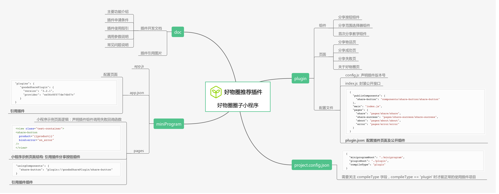
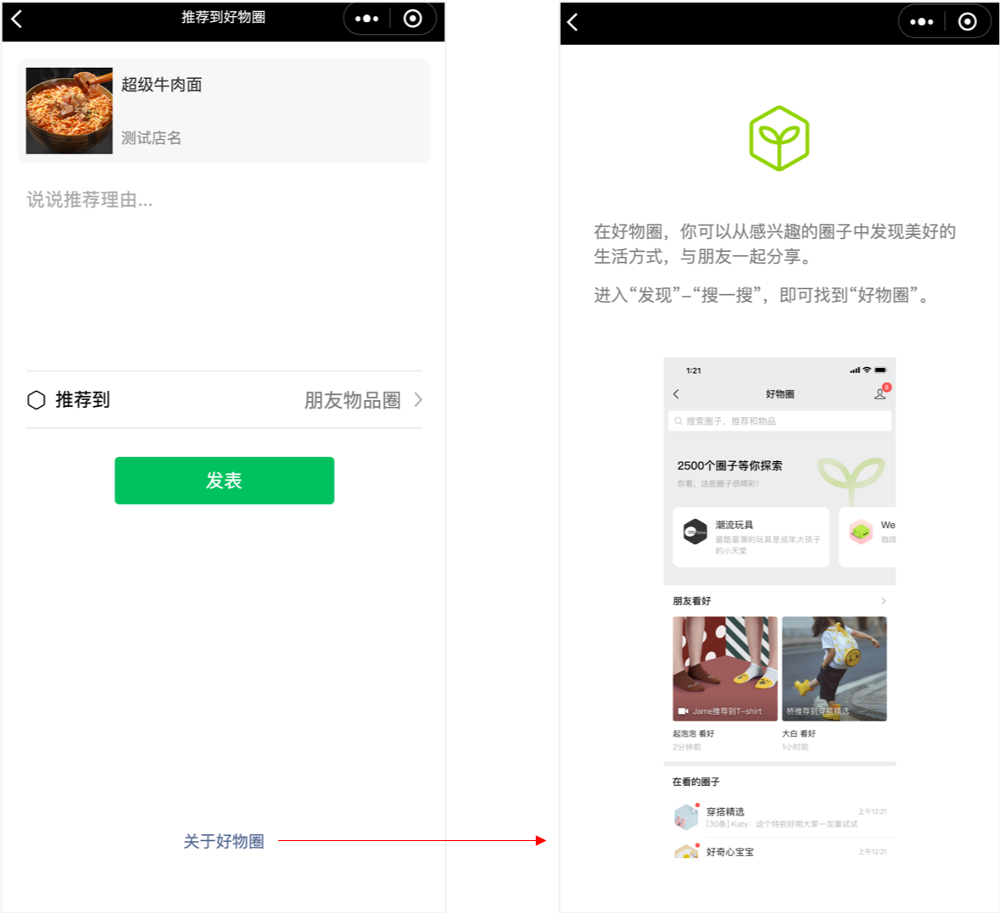
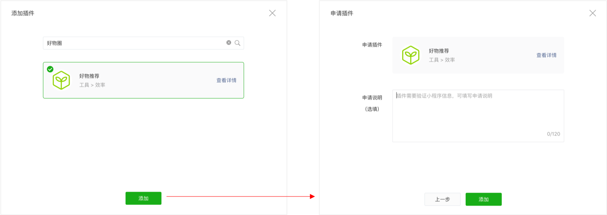
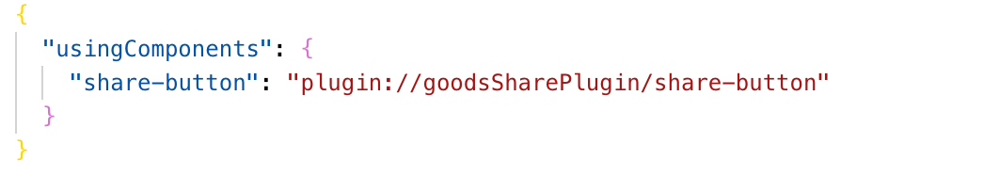
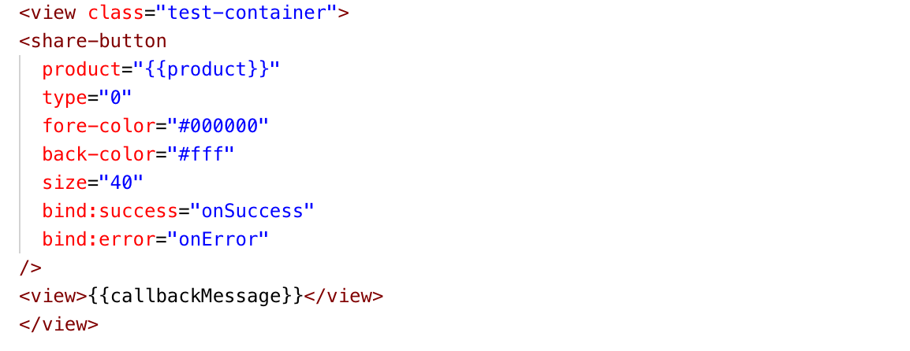
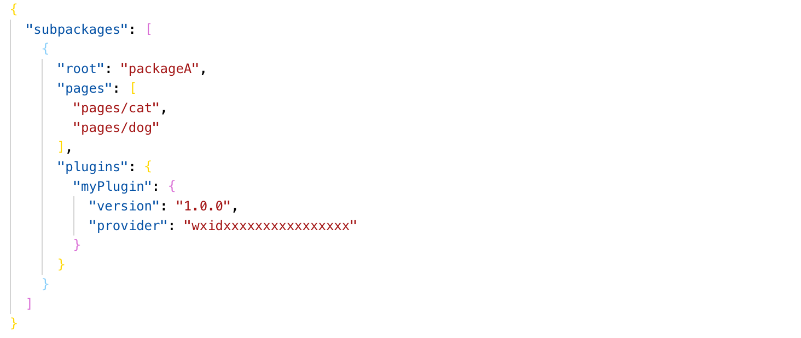
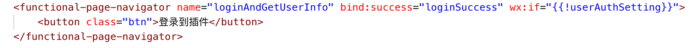
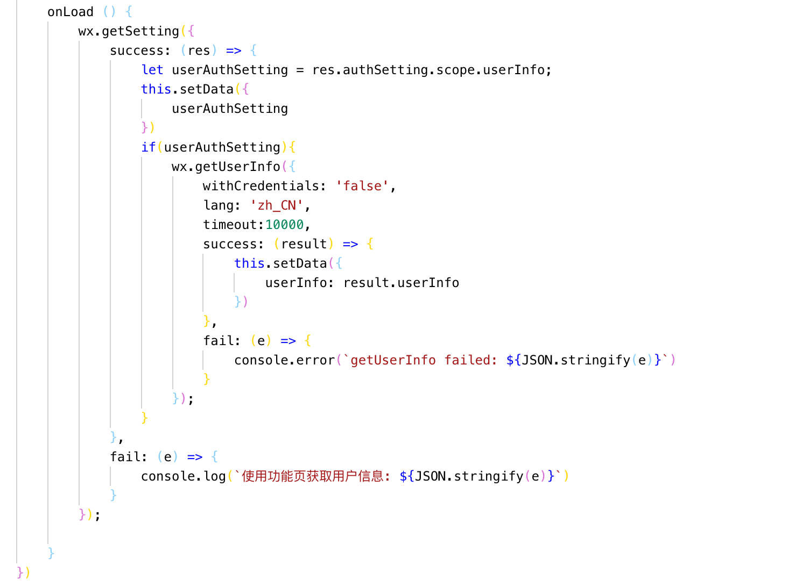
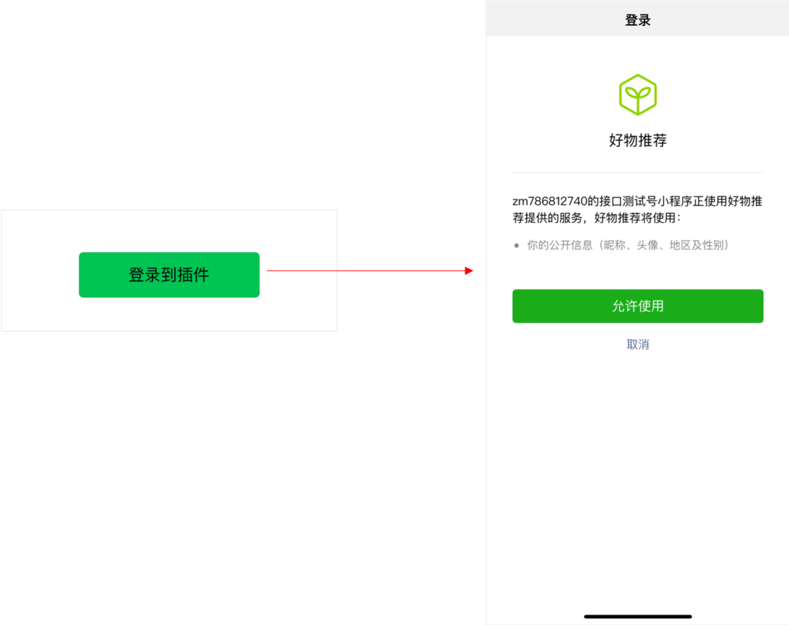
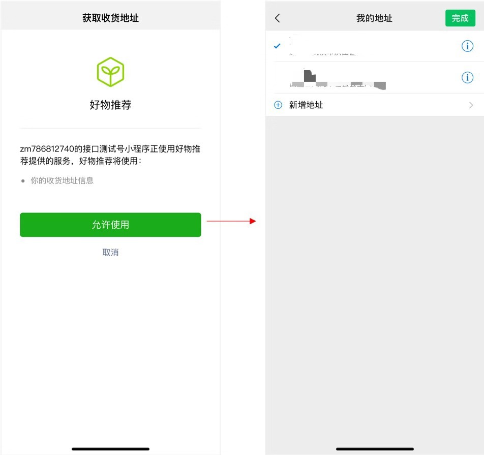

<!-- ---
title: 微信小程序插件初探
date: 2019-07-16
tags: 微信小程序
--- -->

<span style="color:blue;">|导语</span>  微信小程序生态日益完善，小程序提供的功能服务越来越多，类目覆盖面越来越广，服务共享成为小程序生态中必不可少的一环。小程序自 1.9.6 基础库版本开始支持插件支持服务功能的封装和共享，在小程序官方文档中，给出了插件的具体定义：

> 插件是一组对js接口、自定义组件或页面的封装，用于嵌入到小程序中使用。

对于开发者，插件调用方在使用插件时，无法看到插件的代码，插件能够用来封装功能或服务，提供给第三方小程序进行展示或者使用，扩大服务使用场景和受众范围。对于使用者，无需特殊申请类目资质，或搭建全套服务架构，就能够通过插件调用开发者所提供的服务丰富自身能力，例如接入好物推荐，在线客服，名片分享，接入WIFI等插件服务。那么开发者又该如何着手插件的开发，开发中又有什么地方需要特别关注呢？

### 一. 插件的开发

#### 1. 插件的开发

开发者开发插件前需要在已经注册号的小程序管理后台开通插件功能，填写插件基本信息、插件开发信息后，在开发者工具“开发类型”中选择“插件”即可创建插件项目[[插件开通及创建项目指引]]([https://developers.weixin.qq.com/miniprogram/introduction/plugin.html#%E5%BC%80%E5%8F%91%E6%8F%92%E4%BB%B6](https://developers.weixin.qq.com/miniprogram/introduction/plugin.html#开发插件))，新建后的插件项目将包含三个目录，以好物圈提供的“好物推荐”插件为例，创建的插件项目包含的目录及主要内容如下图所示：



可以看到插件项目包含``doc``、``miniProgram``、``plugin``三个目录：

* `doc`目录：插件开发文档
  * 插件文档必须放置在插件项目根目录中的 `doc` 目录下，入口文件是 `doc/README.md`
  * 插件开发文档需要详细列明插件使用者需知的内容，对插件申请条件、插件提供的自定义组件、页面、接口等进行必要的描述和解释，方便第三方小程序正确使用插件；
  * 插件引用到的图片资源不能是网络图片，且必须放到doc目录下，同时为保证插件安全，文档中的链接只能链接到微信开发者社区、微信公众平台、GitHub。

* `miniProgram`目录：示例小程序，方便调试插件、预览和审核
  * 示例小程序中需要引用插件，并在页面中引用插件中的组件来调用插件提供的能力服务；
  * 除非`miniprogramRoot`指定目录为miniProgram，否则miniProgram中的文件内容不会上传
* `plugin`目录：插件代码目录
  * 插件中组件和页面的编写方式与自定义组件相同，包含`json`、`js`、`wxss`、`wxml`四个文件组成；
  * 插件中可以定义任意数量的自定义组件，这些组件在插件内可以相互引用，但提供给第三方小程序使用的组件必须在配置文件中给出；
  * 插件也可以export一些js接口，但提供给第三方小程序使用的接口也必须在配置文件中给出；
  * **插件开发者需要提供插件调用失败、插件调用参数错误、插件调用参数疏漏等特殊情况的错误码和错误信息，以便插件使用者正确使用插件**。
  * 插件包会计入小程序总包的大小，所以插件开发者需要尽量控制插件的大小，避免不必要的逻辑和样式

* `project.config.json`文件：
  * `miniprogramRoot`中指定的目录内容将会在插件上传时作为插件使用Demo一起上传，这个Demo会覆盖到插件的所有使用场景，便于插件的审核
  * `compileType`字段表示项目编译类型，只有当`compileType == 'plugin'` 时才能正常使用插件项目，`miniProgram`中引用的`plugin.version`才可以等于`dev`

针对具体功能的开发实现，插件有其局限性，具体内容将在<span style="color:blue">三. 插件的限制</span>中详细介绍。此外，插件的开发也有其需要特殊注意的地方，特别是在基础库版本、页面跳转、网络请求三个方面：

**1）基础库版本**

目前基础调试库版本已经更新至2.8.0，微信开发者工具针对2.2.2以下的版本会报错提示“🔥请将调试基础库上调到2.2.2以上”，因此插件的开发需要选择基础库 > 2.2.2。

**2）页面跳转**



在插件的开发中常常会涉及到三种情况下的跳转，插件内跳转、插件间跳转和插件与小程序间跳转，都可以使用[``navigator``](https://developers.weixin.qq.com/miniprogram/dev/component/navigator.html)组件和[``wx.navigateTo``](https://developers.weixin.qq.com/miniprogram/dev/api/route/wx.navigateTo.html)API来实现，但**只有页面栈顶是插件页面的时候才可以调用`wx.navigateTo`来实现，且页面栈内不得高于10层**

- 插件内跳转：

  - 基础库版本 < 2.1.0，插件内不支持使用页面

  - 基础库版本 2.1.0 ~ 2.2.2，插件内页面跳转需要设置目标页面的url，例如 
    `plugin-private://PLUGIN_APPID/PATH_TO/PAGE`

    ```javascript
    wx.navigateTo({
        url: `plugin-private://${this.data.pluginAppid}/pages/about/about`,
    })
    ```

  - 基础库版本 > 2.2.2，插件内页面跳转可以使用相对路径作为目标页面的url

    ```javascript
    wx.navigateTo({
        url: `../about/about`,
    })
    ```

- 插件间跳转

  - 插件不能直接引用其他插件，也不能直接跳转至其他插件，但当小程序同时引用了插件A和插件B，插件A、B可以互相跳转与引用，使用方法如下：

    ```json
    // 小程序app.json引用两个插件
    "plugins":  {
      "APlugin": {
        "version": "dev",
        "provider": "wx046..."
      },
      "BPlugin": {
        "version": "1.1.0",
        "provider": "wx047..." 
      }
    }
   
    // 插件A页面index要跳转到插件B pages/test/test，首先要在插件A index.json中定义
    "usingComponents": {
      "test": "plugin-private://BPlugin_APPID/pages/test/test"
    }
    ```
    
    ```html
    // 插件A页面index中定义
    <navigator url="plugin-private://BPlugin_APPID/pages/test/test" >跳转</navigator>
    ```

  - `navigator`组件和`usingComponents`定义中必须严格指定插件页面的路径，否则将会报错`Component is not found in path "plugin-private://BPlugin_APPID/pages/test/test"`

- 插件与小程序间跳转：

  - 小程序跳转至插件：小程序页面的页面栈顶不是插件页面，不满足插件页面跳转的必要条件，因此无法调用``wx.navigateTo``跳转至插件页面，可以使用``navigator``组件实现跳转
  - 插件跳转至小程序：鉴于插件API的限制，不能调用``wx.navigateToMiniProgram``实现插件跳转至小程序，可以使用``navigator``组件或``wx.navigateTo``实现跳转，若使用``wx.navigateTo`` API时同样需要满足**页面栈顶是插件页面**的条件。

**3） 网络请求**

插件在使用[``wx.request``](https://developers.weixin.qq.com/miniprogram/dev/api/network/request/wx.request.html)API发送网络请求时，将会额外携带一个签名``HostSign``，用于验证请求来源于小程序插件，这个签名位于请求头中，形如：

```json
X-WECHAT-HOSTSIGN: {
  "noncestr":"NONCESTR", 
  "timestamp":"TIMESTAMP", 
  "signature":"SIGNATURE"
}
```

其中，``NONCESTR``是一个随机字符串，``TIMESTAMP``是生成这个随机字符串和``SIGNATURE``的UNIX时间戳，他们是生成``SIGNATURE``的参数，签名算法为：

```javascript
SIGNATURE = sha1([APPID, NONCESTR, TIMESTAMP, TOKEN].sort().join(''))
```

其中，主要参数：

* ``APPID``是所在小程序的AppId，可以从请求头的referrer中获得：

  网络请求的referrer格式固定为`https://servicewechat.com/{appid}/{version}/page-frame.html`，其中{appid}为小程序的appid，{version}为小程序的版本号，版本号为0表示为开发版、体验版以及审核版本，版本号为`devtools`表示为开发者工具，其余为正式版本。

* ``TOKEN``是插件TOKEN，可以在小程序插件 --> 基本设置中找到。

* 自基础库版本 2.0.7 开始，小程序运行期间，网络状况正常时，`NONCESTR`和`TIMESTAMP`每10分钟变更一次，如有必要，可以通过判断``TIMESTAMP``判断当前的签名是否有效。

插件开发者可以在服务器上按照以下步骤校验签名：

* ``sort``对``APPID``、``NONCESTR``、``TIMESTAMP``、``TOKEN``四个值表示成字符串形式，按照字典序排序
* ``join``将排好序的四个字符串直接连接在一起
* 对连接结果使用``sha1``算法，结果即为``SIGNATURE``

插件开发者为保证插件的安全性，可以按照以下步骤校验调用方：

* 服务器依据使用者小程序AppId判别是否具备插件调用权限，如不具备则拒绝调用
* 服务器依据签名判别请求签名是否有效，无效则拒绝返回错误码

#### 2. 插件的发布

通过微信开发者工具预览验证后即可准备发布，可以按照以下步骤上传和发布插件：

* **选择上传配置：**在微信开发者工具中配置"上传代码时自动压缩混淆"、“上传代码时进行代码保护”等项目，以压缩插件代码，及保护插件代码安全（TODO）
* **上传代码：**在微信开发者工具中点击“上传”，填写版本号（即为使用者可以指定的插件版本号），即可上传插件代码
* **上传开发文档：**在“编辑器”中打开开发文档，编辑完成后，可以使用编辑器底部的上传入口上传插件文档，上传后的文档不会立刻发布，需要使用账号密码登录插件管理后台，在 小程序插件 > 基本设置 中预览、发布插件文档，文档发布后，可多次更新修改。
* **提交审核：**上传后即可提交审核，提交审核时需要填写准确的插件服务类目、标签及功能描述，同时服务类目需要满足[官方开放的类目范围](https://developers.weixin.qq.com/miniprogram/introduction/plugin.html#开放范围及服务类目)，审核周期一般为7个工作日，审核结果将会通过模板消息、站内信通知管理员。
* **发布新版本：**审核通过后即可发布，发布时需要填写准确的版本更新信息，和支持的最低版本库

需要注意的是插件没有体验版，可以发布多个线上版本，由使用者决定具体使用的版本号。上传后的插件由小程序框架对每个插件进行数据安全保护，保证他们之间不能窃取其他任何一方的数据，同时插件的逻辑代码也无法被使用方看法，这些都依赖于插件的安全隔离机制（TODO，安全隔离机制具体是啥，是否存在代码加密？）

#### 3. 插件的更新

按照上一节插件的发布中的步骤，即可发布更新后的插件代码，需要特别注意的是，在发布时，需要关注选项“快速更新”，勾选快速更新后，系统会为插件使用者管理员统一下发模板消息，模板消息中包含快速更新的链接，支持插件版本的快速更新，该次快速更新免审核。

此外，在插件的更新中需要特别注意的是，为了保证插件更新的稳定性，插件开发者需要保持版本迭代过程中插件所调用数据接口的稳定性。

### 二. 插件的使用

#### 1. 插件的申请



**任何注册的小程序**都可以在小程序后台申请插件，申请后需要等待插件开发者小程序管理员通过后，方可使用插件，如果调用没有通过申请的插件，则使用者小程序白屏，并报错：<span style="color:red">插件申请成功，待审核确认</span>，如果调用未申请的插件，则使用者小程序白屏，并会报错：<span style="color:red">插件未授权</span>。

同时，插件使用者需要关注插件开发文档中的插件申请条件，若不满足申请条件，插件开发者一般不会通过插件申请。

一个小程序最多添加5个小程序插件。

#### 2. 插件的使用

**1）插件基本使用方法**

以“好物推荐”插件为例，使用插件可以按照以下几个步骤：

* 在小程序`app.json`文件中引用插件：

  <!--  -->

* 在引用插件组件的页面中引用插件组件：

  

* 在引用插件组件的页面中写入插件组件：

  

* 在引用插件组件的页面中定义插件所需参数，即可使用插件

* 为保证小程序正常运行，插件使用者需要针对插件调用失败等特殊情况做兜底逻辑

如果插件只在一个分包内用到，可以将插件仅放在这个分包内，例如：


但分包内使用插件有如下限制：

* 在分包内使用的插件仅能在分包内使用；
* 同一个插件不能被多个分包同时引用；
* 不能从分包外的页面直接跳入分包内的插件页面，需要先跳入分包内的非插件页面，再跳入同一分包内的插件页面

**2）依赖版本**

* 引用的插件版本不被支持，即引用的插件版本号 <最低可用版本号，或 >最新版本号，使用者小程序白屏，并报错“插件版本不存在”
* 公共库版本 < 2.2.2，无法正常使用插件，并调试工具报错“将版本更新至🔥请将调试基础库上调到2.2.2以上”
* （TODO：真机测试公共库版本）

**3）其他**

* 插件使用方计算代码包大小时会合并计入引用的插件大小，因此如果插件只有一个分包使用，可以尽量将插件放在分包下
* 插件开发者可以获得因为引用插件而传入的数据，为保护数据安全，要关注插件开发文档中的参数要求，避免传入不必要的数据

#### 3. 插件的更新

若小程序开发者发布小程序时勾选了“快速更新”选项，则插件使用者小程序管理员会在微信收到模板消息，并附有“快速更新”的链接，可以实现一键更新小程序中引用的插件版本，同时该次更新不必审核。

### 三. 插件的限制

#### 1. 调用API的限制

插件可以调用的 API 与小程序不同，主要有两个区别：

- 插件的请求域名列表与小程序相互独立；
- 一些 API 不允许插件调用（这些函数不存在于 `wx` 对象下）。

允许插件调用的API及其对应版本要求列表可参考[官方说明](https://developers.weixin.qq.com/miniprogram/dev/framework/plugin/api-limit.html)，若在插件中调用了不支持的API，监听fail回调，可获得错误信息为`getUserInfo:fail 系统错误，错误码：-12015,system error`。有些接口，例如`wx.login`、`wx.getUserInfo`、虽然在插件中不能使用，但可以通过插件功能页来达到目的，例如用户信息功能页、支付功能以及收货地址功能：

* [用户信息功能页](https://developers.weixin.qq.com/miniprogram/dev/framework/plugin/functional-pages/user-info.html)：相当于调用`wx.login`和`wx.getUserInfo`，自基础库2.3.1开始，用户在功能页授权后，插件就可以直接调用`wx.login`和`wx.getUserInfo`无需再次进入功能页获取信息，自基础库版本2.6.3起，可以使用`wx.getSetting`查询用户是否授权过。用户信息功能页相关开发可按照如下步骤：

  * 在插件页面中引用`functional-page-navigator`

    

  * 在插件页面中声明用户信息获取成功的回调

    

  * 即可使用用户信息
    

* [支付功能页](https://developers.weixin.qq.com/miniprogram/dev/framework/plugin/functional-pages/request-payment.html)：相当于调用`wx.requestPayment`的功能，支付功能页的使用与用户信息功能页类似，`function-page-navigator`参数`name=requestPayment`。**需要注意的是插件使用支付功能，需要在管理后台 小程序插件 -> 基本设置 -> 支付能力”设置项中。另外，无论是否通过申请，主体为个人小程序在使用插件时，都无法正常使用插件里的支付功能。**

* [收货地址功能页](https://developers.weixin.qq.com/miniprogram/dev/framework/plugin/functional-pages/choose-address.html)：相当于调用[`wx.chooseAddress`](https://developers.weixin.qq.com/miniprogram/dev/api/open-api/address/wx.chooseAddress.html)的功能，支付功能页的使用与用户信息功能页类似，`function-page-navigator`参数`name=chooseAddress`。

  ​                             

#### 2. 使用组件的限制

在插件开发中，以下组件不能在插件页面中使用：

- 开放能力（open-type）为以下之一的button：
  - contact（打开客服会话）
  - getPhoneNumber（获取用户手机号）
  - getUserInfo（获取用户信息）
- [open-data](https://developers.weixin.qq.com/miniprogram/dev/component/open-data.html)
- [web-view](https://developers.weixin.qq.com/miniprogram/dev/component/web-view.html)

以下组件的使用对基础库版本有要求：

- [navigator](https://developers.weixin.qq.com/miniprogram/dev/component/navigator.html) 需要基础库版本 [2.1.0](https://developers.weixin.qq.com/miniprogram/dev/framework/compatibility.html)
- [live-player](https://developers.weixin.qq.com/miniprogram/dev/component/live-player.html) 和 [live-pusher](https://developers.weixin.qq.com/miniprogram/dev/component/live-pusher.html) 需要基础库版本 [2.3.0](https://developers.weixin.qq.com/miniprogram/dev/framework/compatibility.html)

