<!-- ---
title: GeoServer安装与配置
date: 2017-08-31
tags: GeoServer
--- -->

GeoServer是 OpenGIS Web 服务器规范的 J2EE 实现，利用 GeoServer 可以方便的发布地图数据，允许用户对特征数据进行更新、删除、插入操作，通过 GeoServer 可以比较容易的在用户之间迅速共享空间地理信息。它兼容 WMS 和 WFS 特性；支持 PostgreSQL、 Shapefile 、 ArcSDE 、 Oracle 、 VPF 、 MySQL 、 MapInfo ；支持上百种投影；能够将网络地图输出为 jpeg 、 gif 、 png 、 SVG 、 KML 等格式；能够运行在任何基于 J2EE/Servlet 容器之上；嵌入 MapBuilder 支持 AJAX 的地图客户端OpenLayers；除此之外还包括许多其他的特性。

**JAVA环境安装配置**

* GeoServer需要JAVA环境，所以需要先安装[JAVA JDK,比如本文下载的是8u152_x64](http://www.oracle.com/technetwork/java/javase/downloads/jdk8-downloads-2133151.html),这里我的安装路径为系统默认的C:\Program Files\Java
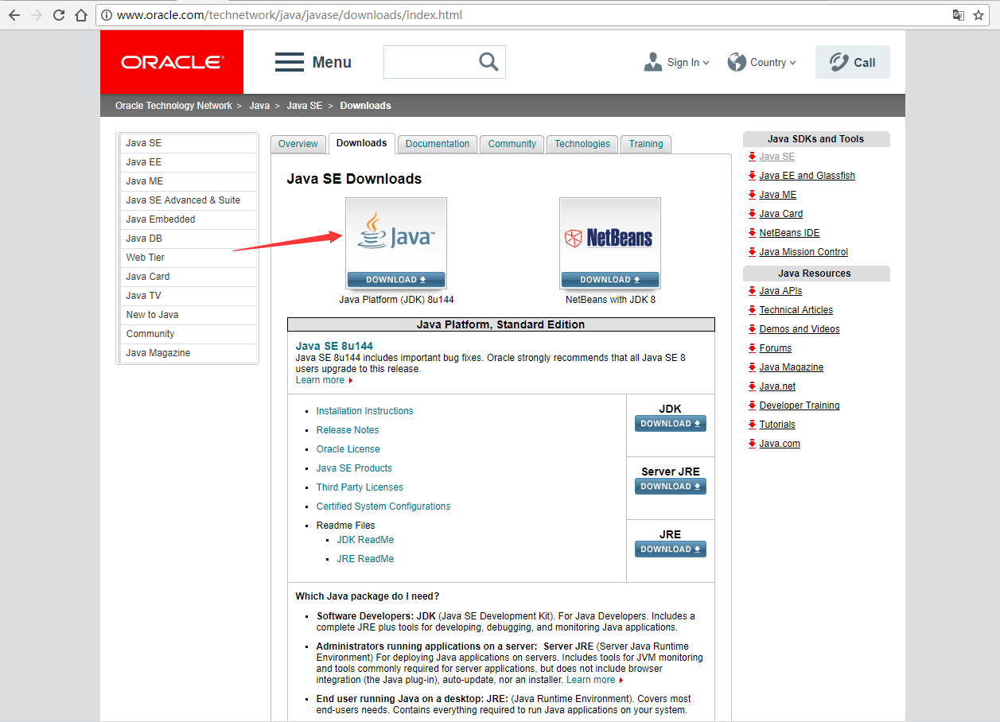
安装之后会存在两个文件包分别是JDK的文件包和JRE的文件包

* 接下来为重要的环境变量配置！！！奉上一个[环境配置链接](http://blog.csdn.net/tiantang_1986/article/details/53894947)

其中需要设置的环境变量为

```
JAVA_HOME：C:\Program Files\Java\jre1.8.0_152
CLASSPATH: .;%JAVA_HOME%\jdk1.8.0_152\lib
Path: %JAVA_HOME%\jdk1.8.0_152\bin
```

* cmd命令输入java -version如果出现对应版本号，说明配置成功

**GeoServer安装**

* 首先下载，Stable版本的GeoServer无需安装TomCat等服务器，如果想要用TomCat来运行的话，选择下载Web Archive，不做解释。[GeoServer——Stable](http://geoserver.org/download/)
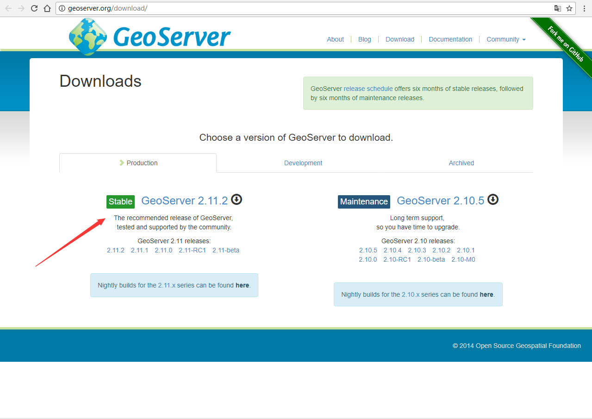

* 安装过程中就按照指令一步步安装就好了，其中需要注意的有：

(1)首先，JRE的路径选择，JRE的路径为上文提到的C:\Program Files\Java下的C:\Program Files\Java\jre1.8.0_144
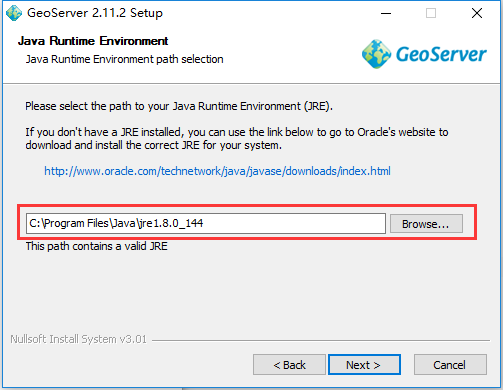

(2)其次，GeoServer运行端口的选择，以及登录名和密码的设置

* 以上都完成了之后，Start GeoServer，成功运行之后，浏览器打开http://localhost:7070/geoserver/web/，输入用户名密码之后便可操作

**利用GeoServer发布WMS**

* 新建工作区
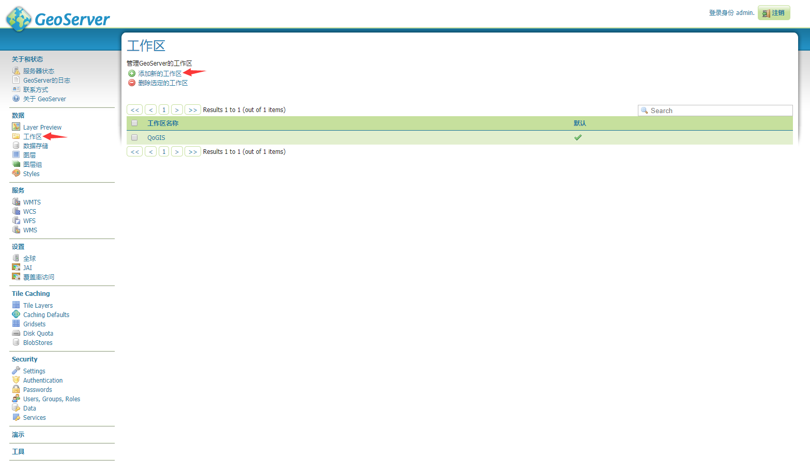

命名工作区
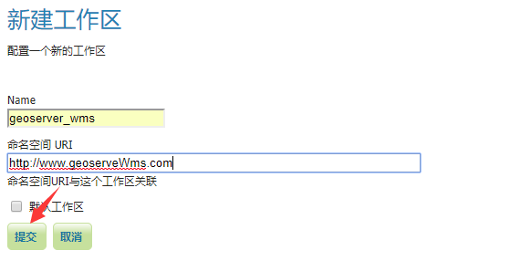

* 新建数据存储，
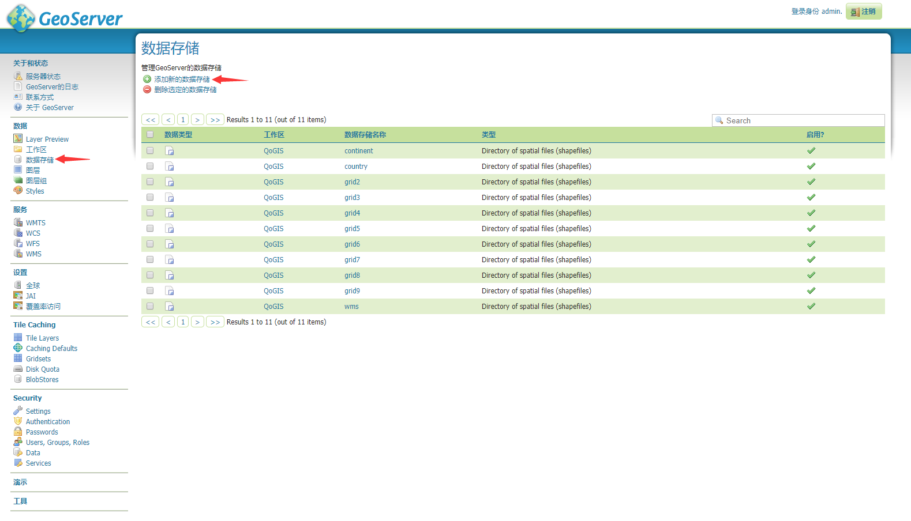

这里选择的是shp文件
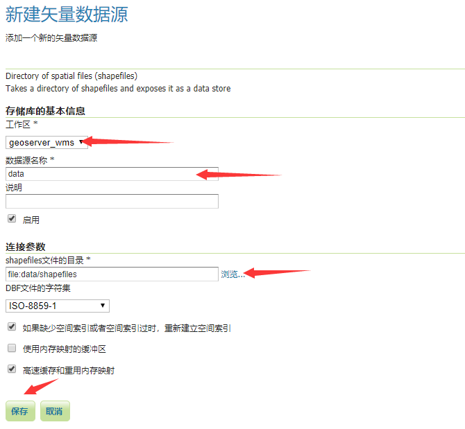

发布该数据
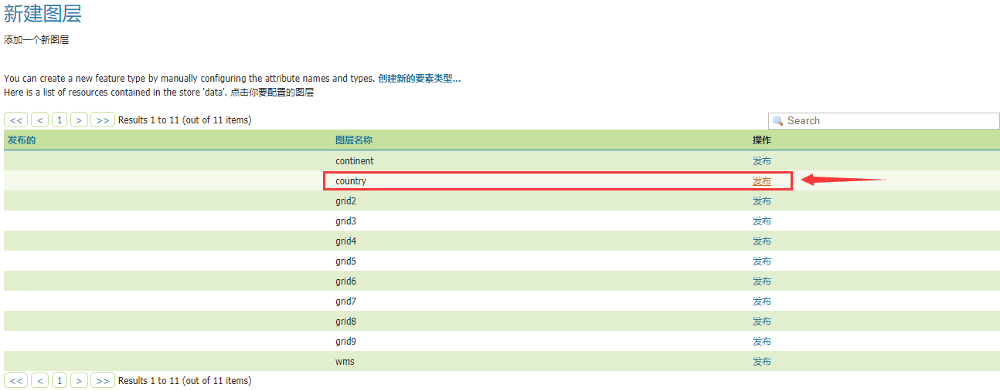

设置投影，并计算经纬度包围盒
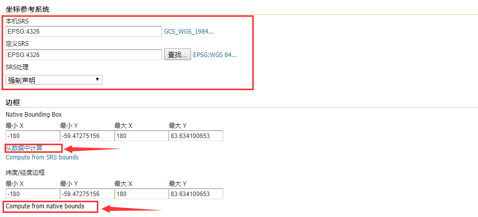

* 新建样式，这里选择的是sld文件
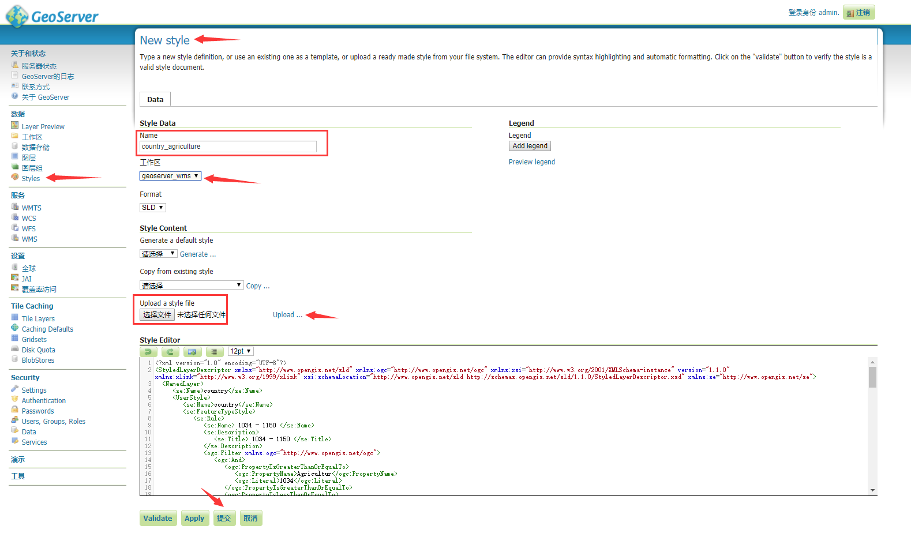

* 预览图层
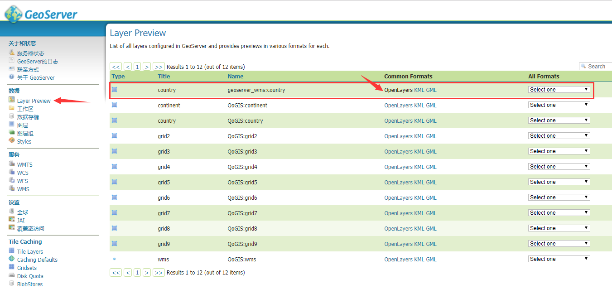

输入样式名，显示对应样式下的WMS
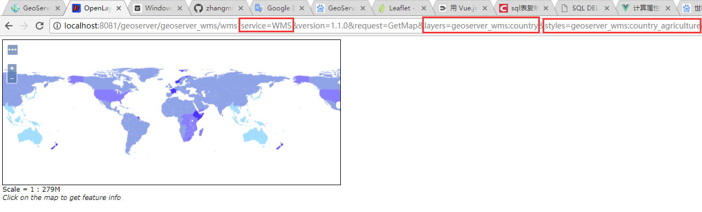
                

