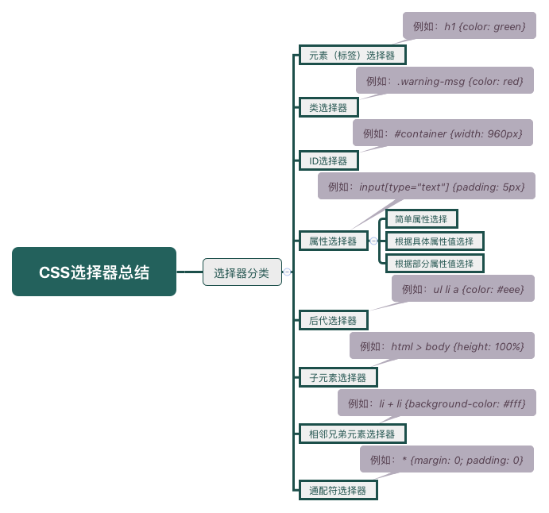

<!-- ---
title: CSS选择器
date: 2018-01-13
tags: CSS
--- -->

CSS选择器可用于实现对HTML网页上的元素样式的一对一，一对多或者多对一的控制。本篇将从CSS选择器的分类、区别、优先级三方面讲述。

## 分类

### 标签选择器
直接引用HTML中的标签控制相应元素样式
```
p {
  color: yellow;
}
```

### 类选择器：
利用自定义的类名控制相应元素样式
```
.className{
    background-color: red;
}
```
### ID选择器
利用自行定义的ID名控制相应元素样式，因为选择器的级联关系，建议非必要时少用
```
#idName{
    background-color: yellow;
}
```
### 群组选择器
多种选择器组合成为一组，控制同一种样式，选择器之间用，隔开
```
p,.className,#idName{
    background-color: red;
}
```
### 子选择器
两个常用选择器，中间通过>进行选择，其中前面的选择器选择父元素，后面的选择器选择父元素第一代孩子中全部对应的元素
```
<style>
#box > span {color:red;}
</style>

<div id="box">
<h2>测试子选择器</h2>
<span>第一个span标签</span>
<p><span>第二个span标签</span></p>
</div>
//  父元素box中的第一代孩子中的span元素字体将被设置为红色，而包含在p标签 
中的span元素（box元素的第二代孩子）则没有被影响。
```

#### 拓展

* :first-child 匹配包含在其父元素中，每个作为首孩子出现的元素。（不限元素类型）
* :last-child 匹配包含在其父元素中，每个作为最后孩子出现的元素。
* :only-child 匹配包含其父元素中，每个作为唯一孩子出现的元素。
* :nth-child(n) 匹配包含在父元素中，每个作为第n个孩子出现的元素。（n 可以是数字、关键词或公式）
* :first-of-type 匹配包含在其父元素中，每个作为首孩子出现的特定类型元素。
* :last-of-type 匹配包含在其父元素中，每个作为最后孩子出现的特定类型元素。
* :nth-of-type(n) 匹配包含在父元素中，每个作为第n个孩子出现的的特定类型元素。 （n 可以是数字、关键词或公式）

### 后代选择器
用两个常用选择器，中间用空格隔开，前面的选择器选择父元素，后面的选择器选择父元素全部孩子中全部对应的元素
```
<style>
#box span {color:red;}
</style>

<div id="box">
<h2>测试子选择器</h2>
<span>第一个span标签</span>
<p><span>第二个span标签</span></p>
</div>
//  父元素box的后代中的所有span元素的字体都会被设置成红色。
```
### 相邻同胞选择器
用两个常用选择器，中间通过+选择，作用于前面选择器同胞的，且是后面选择器选择的第一个元素
```
<style>
p+span{color:red;}
</style>

<div id="box">
<h2>测试相邻同胞选择器选择器</h2>
<p><span>第一个span标签</span></p>
<span>第二个span标签</span>
<span>第三个span标签</span>
</div>
//  第二个span标签和p标签同胞故字体将被设置为红色。
```
### 伪类选择器
有时候还会需要用文档以外的其他条件年实现元素的样式
```
<style>
a:hover{
    color:red;
}
</style>
```

* :link 设置元素初始样式。
* :visited 设置元素被访问后的样式。
* :hover 设置鼠标悬停时样式。
* :active 设置鼠标点击瞬间的样式。

--> 在CSS 定义中，a:hover 必须被置于 a:link 和 a:visited 之后，a:active 必须被 
置于 a:hover 之后，才是有效的。若要同时设置这四种，一般设置顺序为LVHA。
--> 该种伪类一般被应用在链接上，也可以应用在其他元素上，例如表单元素中。

### 属性选择器
通过判断元素中是否存在html中某个属性或者符合某个属性值来选择作用该元素。
```
<style>
p[title]{
    color:red;
}
</style>

<p title="tag">我是含有title标签的p标签，我将变红色。</p>
```

```
<style>
p[title="tag2"]{
    color:red;
}
</style>
    
<p title="tag1">我是含有title标签且值为tag1的p标签。</p>
<p title="tag2">我是含有title标签且值为tag2的p标签，我将变红色。</p>
```
### 通配选择器
通用选择器用``*``来表示,选择作用于所有元素。
```
*{
 color:red;
}
```

## 区别

### Class和ID的区别

* 书写上的差别：class名用“.”号开头来定义，id名用“#”号开头来定义； 
* 调用上的区别：在同一个html网页页面中class是可以被多次调用的（在不同的地方）。而id名作为标签的身份则是唯一的，id在页面中只能出现一次。在js脚本中经常会用到id来修改一个标签的属性 
* id作为元素的标签，用于区分不同结构和内容，而class作为一个样式，它可以应用到任何结构和内容上。 
* 在布局思路上，一般坚持这样的原则：id是先确定页面的结构和内容，然后再为它定义样式：而class相反，它先定义好一类样式，然后再页面中根据需要把类样式应用到不同的元素和内容上面。 
* 在实际应用时，class更多的被应用到文字版块以及页面修饰等方面，而id更多地被用来实现宏伟布局和设计包含块，或包含框的样式。

### 伪类和伪元素的区别

* 伪类本质上是为了弥补常规CSS选择器的不足，以便获取到更多信息；
```
*:nth-child(n)查找元素的第n个元素
*:checked,*:disabled,*:link,*:visited,*:hover,*:active
```
* 伪元素本质上是创建了一个有内容的虚拟容器；
```
*::before,*::after,*::first-letter,*::first-line
```
* CSS3中伪类和伪元素的语法不同：伪类为一个冒号，伪元素为两个冒号；
* 可以同时使用多个伪类，而只能同时使用一个伪元素
* 伪类的效果可以通过添加一个实际的类来达到，而伪元素的效果则需要通过添加一个实际的元素才能达到，这也是为什么他们一个称为伪类，一个称为伪元素的原因。

## 优先级



作者的样式表是由站点开发者编写的，被认为是最重要的样式表。用户可以用过浏览器应用自己的样式，这些样式表的重要度低一级。最后是浏览器或用户代理使用的默认样式表，它们的重要度是最低的，所以你总是可以覆盖它们。

样式选择器的优先级顺序如下：

* important权重为10000
* style=""内联样式权重为1000
* ID选择器的权重为100
* 类选择器的权重为10
* 伪类选择器的权重为10
* 属性选择器的权重为10
* 标签选择器的权重为1
* 伪元素选择器的权重为1
* 通配选择器的权重为0