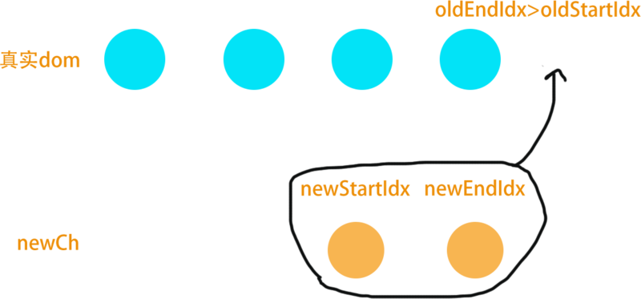
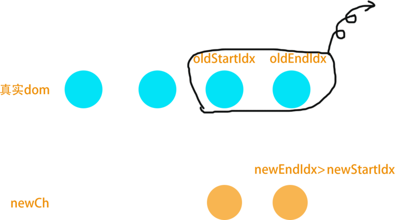
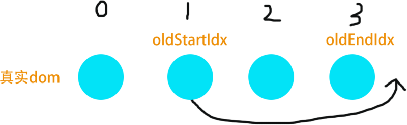
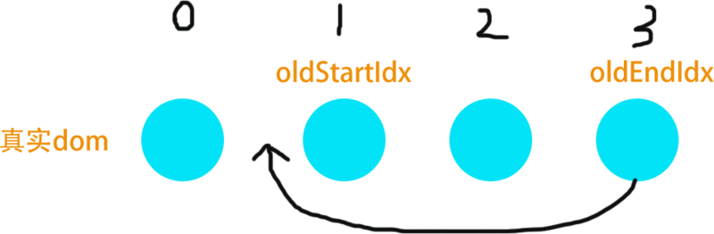

<!-- ---
title: 数据更新到视图更新，Vue做了什么
date: 2018-10-15
tags: JavaScript, Vue
--- -->

我们都知道Vue存在双向绑定机制，数据更新之后会触发Observer的set方法，进一步触发Watcher，进行视图的更新操作。那么视图的更新是否是对真实DOM进行更新操作的呢？视图更新过程中又有什么Vue独特的性能优化方案呢？

实际上，Vue2.0加入了Virtual DOM，在页面更新渲染时，Vue会先依据更新后的数据渲染生成虚拟DOM，在虚拟DOM和更新前的虚拟DOM进行diff运算，得到所有需要在DOM上进行的变更，然后在 patch 过程中应用到真实DOM上实现视图的同步更新。本节讲述的主要内容便是虚拟DOM，DOM的diff算法以及DOM的patch算法

## 虚拟DOM

**首先，虚拟DOM是什么？**

真实的DOM可以通过``document.CreateElement`` 和 ``document.CreateTextNode``创建；虚拟DOM是一个纯粹的JS对象，可以通过``document.createDocumentFragment`` 创建，Vue中一个虚拟DOM包含以下属性：

* tag: 当前节点的标签名
* data: 当前节点的数据对象
* children: 数组类型，包含了当前节点的子节点
* text: 当前节点的文本，一般文本节点或注释节点会有该属性
* <p style="color:red">elm: 当前虚拟节点对应的真实的dom节点</p>
* context: 编译作用域
* functionalContext: 函数化组件的作用域
* <p style="color:blue">key: 节点的key属性，用于作为节点的标识，有利于patch的优化</p>
* <p style="color:blue">sel: 节点的选择器</p>
* componentOptions: 创建组件实例时会用到的选项信息
* child: 当前节点对应的组件实例
* parent: 组件的占位节点
* raw: raw html
* isStatic: 静态节点的标识
* isRootInsert: 是否作为根节点插入，被<transition>包裹的节点，该属性的值为false
* isComment: 当前节点是否是注释节点
* isCloned: 当前节点是否为克隆节点
* isOnce: 当前节点是否有v-once指令

**为什么要使用虚拟DOM？**

虚拟DOM因为是纯粹的JS对象，所以操作它会很高效。虽然很多时候手工优化dom确实会比virtual dom效率高，对于比较简单的dom结构用手工优化没有问题，但当页面结构很庞大，结构很复杂时，手工优化会花去大量时间，而且可维护性也不高，不能保证每个人都有手工优化的能力。至此，virtual dom的解决方案应运而生，virtual dom很多时候都不是最优的操作，但它具有普适性，在效率、可维护性之间达平衡。

virtual dom 另一个重大意义就是提供一个中间层，js去写ui，ios安卓之类的负责渲染，就像reactNative一样。

## patch过程

Vue在对同级虚拟DOM和真实DOM进行对比执行，当新旧虚拟节点的key和sel都相同时，则进行节点的深度patch，若不相同则整个替换虚拟节点，同时创建真实DOM，实现视图更新。
```
function patch (oldVnode, vnode) {
    if (sameVnode(oldVnode, vnode)) { // 有必要进行patch, key和sel都相同时才进行patch
        patchVnode(oldVnode, vnode)
    } else {  // 没有必要进行patch, 整个替换
        const oEl = oldVnode.el
        let parentEle = api.parentNode(oEl)
        createEle(vnode) // vnode创建它的真实dom，令vnode.el =真实dom
        if (parentEle !== null) {
            api.insertBefore(parentEle, vnode.el, api.nextSibling(oEl)) // 插入整个新节点树
            api.removeChild(parentEle, oldVnode.el) // 移出整个旧的虚拟DOM
            oldVnode = null
        }
    }
    return vnode
}
```
那么节点的深度patch过程如何呢？源码如下，分为注释中的四个情况来分别讨论patch过程
```
function patchVnode (oldVnode, vnode) {
    const el = vnode.el = oldVnode.el  // vnode.el引用到现在的真实dom; 当el修改时，vnode.el会同步变化。
    let i, oldCh = oldVnode.children, ch = vnode.children
    if (oldVnode === vnode) return //可以认为没有变化
    if (oldVnode.text !== null && vnode.text !== null && oldVnode.text !== vnode.text) { //1. 文本内容不同，则只进行文本替换
        api.setTextContent(el, vnode.text)
    }else {  
        updateEle(el, vnode, oldVnode)
        if (oldCh && ch && oldCh !== ch) { // 2. 两个节点都有子节点且不一样，则调用updateChildren函数比较子节点，是diff的核心
            updateChildren(el, oldCh, ch)
        }else if (ch){
            createEle(vnode) // 3. 只有新节点有子节点，调用createEle(vnode)，在老dom节点上添加子节点
        }else if (oldCh){
            api.removeChildren(el) // 4. 新节点没有子节点，老节点有子节点，直接删除老节点。
        }
    }
}
```

## diff算法

接下来就是最复杂的diff算法的理解了，diff算法用于比较新旧虚拟节点树，是视图更新渲染的关键。下面是一张很经典的图，出自《React’s diff algorithm》，Vue的diff算法也同样，即仅在同级的vnode间做diff，递归地进行同级vnode的diff，最终实现整个DOM树的更新。


diff的简易源码如下：
```
updateChildren (parentElm, oldCh, newCh) {
    let oldStartIdx = 0, newStartIdx = 0
    let oldEndIdx = oldCh.length - 1
    let oldStartVnode = oldCh[0]
    let oldEndVnode = oldCh[oldEndIdx]
    let newEndIdx = newCh.length - 1
    let newStartVnode = newCh[0]
    let newEndVnode = newCh[newEndIdx]
    let oldKeyToIdx
    let idxInOld
    let elmToMove
    let before
    while (oldStartIdx <= oldEndIdx && newStartIdx <= newEndIdx) {
        if (oldStartVnode == null) {   //对于vnode.key的比较，会把oldVnode = null
            oldStartVnode = oldCh[++oldStartIdx] 
        }else if (oldEndVnode == null) {
            oldEndVnode = oldCh[--oldEndIdx]
        }else if (newStartVnode == null) {
            newStartVnode = newCh[++newStartIdx]
        }else if (newEndVnode == null) {
            newEndVnode = newCh[--newEndIdx]
        }else if (sameVnode(oldStartVnode, newStartVnode)) {
            patchVnode(oldStartVnode, newStartVnode)
            oldStartVnode = oldCh[++oldStartIdx]
            newStartVnode = newCh[++newStartIdx]
        }else if (sameVnode(oldEndVnode, newEndVnode)) {
            patchVnode(oldEndVnode, newEndVnode)
            oldEndVnode = oldCh[--oldEndIdx]
            newEndVnode = newCh[--newEndIdx]
        }else if (sameVnode(oldStartVnode, newEndVnode)) {
            patchVnode(oldStartVnode, newEndVnode)
            api.insertBefore(parentElm, oldStartVnode.el, api.nextSibling(oldEndVnode.el))
            oldStartVnode = oldCh[++oldStartIdx]
            newEndVnode = newCh[--newEndIdx]
        }else if (sameVnode(oldEndVnode, newStartVnode)) {
            patchVnode(oldEndVnode, newStartVnode)
            api.insertBefore(parentElm, oldEndVnode.el, oldStartVnode.el)
            oldEndVnode = oldCh[--oldEndIdx]
            newStartVnode = newCh[++newStartIdx]
        }else {
            // 使用key时的比较
            if (oldKeyToIdx === undefined) {
                oldKeyToIdx = createKeyToOldIdx(oldCh, oldStartIdx, oldEndIdx) // 有key生成index表
            }
            idxInOld = oldKeyToIdx[newStartVnode.key]
            if (!idxInOld) {
                api.insertBefore(parentElm, createEle(newStartVnode).el, oldStartVnode.el)
                newStartVnode = newCh[++newStartIdx]
            }
            else {
                elmToMove = oldCh[idxInOld]
                if (elmToMove.sel !== newStartVnode.sel) {
                    api.insertBefore(parentElm, createEle(newStartVnode).el, oldStartVnode.el)
                }else {
                    patchVnode(elmToMove, newStartVnode)
                    oldCh[idxInOld] = null
                    api.insertBefore(parentElm, elmToMove.el, oldStartVnode.el)
                }
                newStartVnode = newCh[++newStartIdx]
            }
        }
    }
    if (oldStartIdx > oldEndIdx) {
        before = newCh[newEndIdx + 1] == null ? null : newCh[newEndIdx + 1].el
        addVnodes(parentElm, before, newCh, newStartIdx, newEndIdx)
    }else if (newStartIdx > newEndIdx) {
        removeVnodes(parentElm, oldCh, oldStartIdx, oldEndIdx)
    }
}
```

### 过程概述

过程比较复杂，概括可以理解为：首先设置新旧虚拟DOM节点的孩子树``newCh``、``oldCh``的起始``StartIdx``、结尾索引``EndIdx``。它们的2个变量相互比较，一共有4种比较方式。如果4种比较都没匹配，如果设置了key，就会用key进行比较，在比较的过程中，变量会往中间靠，一旦StartIdx>EndIdx表明oldCh和newCh至少有一个已经遍历完了，就会结束比较。


结束时存在两种具体的情况：

1. ``oldStartIdx > oldEndIdx``，可以认为oldCh先遍历完。当然也有可能newCh此时也正好完成了遍历，统一都归为此类。此时newStartIdx和newEndIdx之间的vnode是新增的，调用addVnodes，把这些虚拟node.elm全部插进before的后边.

    

2. ``newStartIdx > newEndIdx``，可以认为newCh先遍历完。此时oldStartIdx和oldEndIdx之间的vnode在新的子节点里已经不存在了，调用removeVnodes将这些虚拟node.elm从dom里删除。

    

### 过程详解

diff的具体遍历比较过程可以归纳为4种情况：

1. 当新旧起始节点为``null``时，则将起始索引``++``,并更新起始节点；同样的，当新旧结尾节点为``null``时，则将结尾索引``--``，并更新结尾节点
2. 当新旧起始节点相同时（即key和sel都相同），则``patchVnode``进行patch，同时将新旧起始索引``++``；同样的，当新旧结尾节点相同时（即key和sel都相同），则``patchVnode``进行patch，同时将新旧结尾索引``--``
3. 当旧起始节点和新结尾节点相同时，``patchVnode``进行patch，将oldStartNode.elm移动到旧结尾节点oldEndNode.elm之后，旧起始索引``++``新结尾索引``--``；<br/>
    <br/>
同理，当新起始节点和旧结尾节点相同时，``patchVnode``进行patch，将旧结尾节点oldEndNode.elm移动到旧起始节点oldStartNode.elm之后，旧结尾索引``--``新起始索引``++``;<br/>
    
4. 以上情况都不是的时候，使用key进行比较，从用旧虚拟节点树key生成的对象oldKeyToIdx中查找匹配的节点，所以为节点设置key可以更高效的利用dom。
    * 若新起始节点的key不在oldKeyToIdx中，在旧起始节点位置上插入新起始节点，同时新起始索引``++``
    * 若新起始节点的key在oldKeyToIdx中，且key相同的两个虚拟节点sel相同，则``patchVnode``进行patch，把key相同的旧虚拟节点的elm移动到oldStartVnode.elm之前，新起始索引``++``
    * 若新起始节点的key在oldKeyToIdx中，且key相同的两个虚拟节点sel不同，则在把新起始节点的elm插入到oldStartVnode.elm之前，新起始索引``++``

自此，整个视图更新渲染过程中，Vue所做的事情就已经介绍完啦~~~

参考文献：

1. [深入Vue2.x的虚拟DOM diff原理](https://blog.csdn.net/m6i37jk/article/details/78140159)
2. [解析vue2.0的diff算法](https://segmentfault.com/a/1190000008782928)
3. [Vue原理解析之Virtual Dom](https://segmentfault.com/a/1190000008291645)