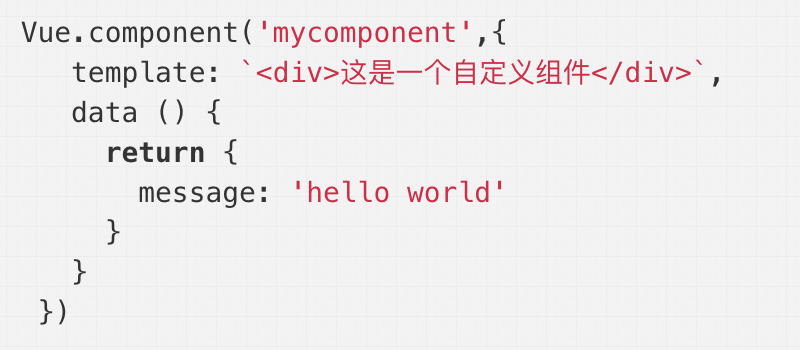
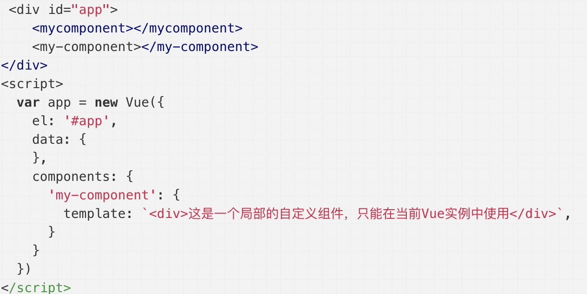
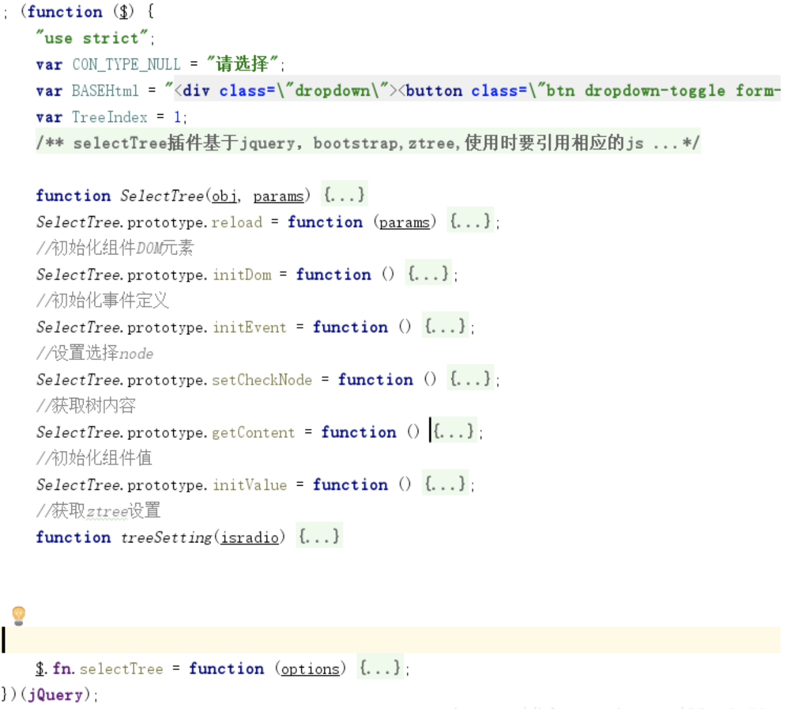

<!-- ---
title: 理解Vue
date: 2018-10-16
tags: JavaScript, Vue
--- -->

Vue目前已经成为很多公司的开发框架，使用范围极广，这篇文章我想谈论一下我对Vue的基本理解，包含其概念、双向绑定、组件式开发、生命周期几部分内容。

## 概念

> Vue是一套用于构建用户界面的渐进式框架。与其它大型框架不同的是，Vue 被设计为可以自底向上逐层应用。

Vue的概念中提到一个主要的关键概念叫渐进式框架，那什么是**渐进式框架**呢？

渐进式框架是指没有强主张，对框架的使用没有强约束关系，可以将Vue当做Jquey只使用他的页面模板，也可以只使用其数据绑定和组件式开发特性，完全不care vuex,vue-router这样的周边工具，也可以使用vue全家桶搭建复杂的单页应用，这种模式便是渐进式开发框架。

Vue能够用最简单的命令实现尽可能大的功能，极易上手的框架开发、HTML规则的语法模板都是其获得大范围用户群体的原因，但Vue最主要的特性还是**数据双向绑定**机制及**组件式开发**模式。以下是这两方面内容的具体介绍。

## 双向绑定

双向绑定是指视图变化的时候能够响应到数据属性的更新，而数据属性的更新也能够快速响应到视图的变化。这里附上我自己根据Vue源码编写的[简易版数据双向绑定实现代码](https://github.com/zhangmingemma/framework-source-exercise/tree/master/bilateral-bind)

### 实现

数据双向绑定的实现主要依赖与三个功能模块：

* 观察者Observer: 观察监听数据的变化
* 订阅者Watcher: 将创建的实例中的data添加维护为订阅者列表，当数值更新变化的时候，通知指令解析器
* 指令解析器Compiler: 解析DOM中的指令模板，绑定指令监听事件

整个双向绑定实现的过程是从Vue实例创建时开始的，具体过程：

* 创建Vue实例：这个时候的代码如下，主要做了两件事情
    ```
    function MVVM(options){
        this.data = options.data;
        var data = this.data,me = this;
        Object.keys(data).forEach(function(key){
            me._proxy(key);
        })
        observe(data); //将数据属性添加到Observer中
        this.$compile = new Compile(options.el || document.body,this); //解析页面模板
    }
    ```
    * 其一是将data中定义的键值添加到观察者列表中，通过Object.defineProperty的get和set方法观察监听数据的变化；

      ```
      function observe(data){
          Object.keys(data).forEach(function(key){
              defineReactive(data,key,data[key]); //为每一个数据项绑定数据值监听
          })
      }
      function defineReactive(data,key,val){
          var dep  = new Dep();
          observe(val); //递归监听数据元素中的所有子元素
          Object.defineProperty(data, key, {
              get:function(){  //获取值时触发get方法
                  return val;
              },
              set:function(newval){  //更改值时触发set方法
                  if (newval === val) {
                      return;
                  }
                  val = newval;
                  dep.notify();//通知Watcher
              }
          })
      }
      ```
    * 其二是将实例中包含的元素逐一由指令解析器解析，按分类为绑定事件的元素添加事件监听，将绑定v-model的添加input事件监听；

      ```
      function compile(el,vm){
          this.vm = vm; //vm是整个MVVM实例，即MVVM.js中的options,data都包含
          this.$el = document.querySelector(el); //el是真实的DOM节点
          this.$fragment = this.node2Fragment(this.$el); //创建虚拟DOM节点
          this.compileElement(this.$fragment); //解析页面模板
          this.$el.appendChild(this.$fragment);
      }
      function compileElement(el){
          var childNodes = el.childNodes,
              me = this;
          [].slice.call(childNodes).forEach(function(node){
              var reg = /\{\{(.*)\}\}/; //正则表达式匹配页面模板
              var text = node.textContent;
              if(node.nodeType == 1){
                  me.compile(node); //解析“v-”绑定的数据节点，如果绑定v-model，则注册时间监听页面视图变化
              }else if(node.nodeType == 3 && reg.test(text)){
                  me.compiletext(node,RegExp.$1); //解析“{{}}”绑定的数据节点
              }
              if (node.childNodes && node.childNodes.length) {
                  me.compileElement(node); //递归解析所有子节点
              }
          })
      }
      ```
    * 而在指令解析的过程中会将绑定v-数据的全部都添加入订阅者列表，自此数据双向绑定的功能链条已经完全实现
    
      ```
      function compiletext(node,exp){  //为{{}}绑定的数据属性添加Watcher
          var me = this,
              initText = this.vm[exp];
          this.updatetext(node,initText);
          new Watcher(this.vm,exp,function(val){
              me.updatetext(node,val);
          })
      } 
      function modelHandler(node,vm,exp,dir){ //为v-model绑定的数据属性添加Watcher
          var me = this,
              val = this.vm[exp];
          this.modelUpdater(node,val);
          new Watcher(me.vm,exp,function(value){
              me.modelUpdater(node,value);
          });
          node.addEventListener('input',function(e){ //为v-model绑定注册监听事件
              var newValue = e.target.value;
              if(val === newValue){return;}
              me.vm[exp] = newValue;
              val = newValue;
          })
      },
      ```
* 数据变化 -----> 视图变化
    * 当数据变化的时候，会触发观察者的set方法，从而触发发生变化的数据属性对应的Watcher，
    * Watcher会触发指令解析器，将视图中某一节点node.value替换为新的值  
* 视图变化 -----> 数据变化
    * 当在输入框输入文字的时候，触发input的监听事件
    * 将input的node的值赋给绑定订阅者列表中绑定的键值，从而更新数据

### special point

Vue官方文档中[列表渲染](https://cn.vuejs.org/v2/guide/list.html#%E6%95%B0%E7%BB%84%E6%9B%B4%E6%96%B0%E6%A3%80%E6%B5%8B)中描述了Vue在数据监听中的特殊之处

#### 第一方面  Vue不能检测对象属性的添加或删除

> 由于 JavaScript 的限制，Vue 不能检测对象属性的添加或删除：
>
> 对于已经创建的实例，Vue 不能动态添加根级别的响应式属性。但是，可以使用 
>   * Vue.set(object, key, value) 方法向嵌套对象添加响应式属性。例如：Vue.set(vm.userProfile, 'age', 27)
>   * 使用 Object.assign 方法，直接赋值的原理监听。例如：this.watchObj = Object.assign({}, this.watchObj, {name: 'xiaoyue',age: 15});

原因是由于Vue在初始化实例时就对属性执行了setter/getter转化过程，所以属性必须开始就在对象上，这样才能让Vue转化监听，后期添加的属性无法进行变化监测。

#### 第二方面 数组变化监听的特殊之处

我们知道Vue能够监听**整个对数组进行赋值更新**，**对数组使用变异方法进行更新**，并可以响应到视图跟新中，Vue的官方文档中有这样的一段描述：

> Vue 包含一组观察数组的变异方法，所以它们也将会触发视图更新。这些方法有push()、pop()、shift()、unshift()、splice()、sort()、reverse()
>
> 由于 JavaScript 的限制，Vue 不能检测以下变动的数组：
> 1. 当你利用索引直接设置一个项时，例如：vm.items[indexOfItem] = newValue
> 2. 当你修改数组的长度时，例如：vm.items.length = newLength

举个例子：
```
var vm = new Vue({
  el: '#demo',
  data: {
      nameArray:['Foo' ,'Bar']
  },
  computed: {
    fullName: function () {
      return this.nameArray[0] + ' ' + this.nameArray[1]
    }
  },
  methods: {
    change () {
        this.nameArray[0] = '123'; //fullName不会发生改变
        this.nameArray = ['123','Bar']; //fullName发生改变
        this.nameArray.splice(0, 1, '123'); //fullName发生改变
        this.$set(this.nameArray, 0, '123'); //fullName发生改变
    }
  }
})
```
其实很简单的可以理解为什么Vue无法监听数组中新增的属性，因为在Vue实例创建的时候，数组中的每个元素就被添加到了Observer的列表中，监测器变化，支持视图响应，新增的属性无法添加到Observer的列表中，因此没有办法响应到视图，对此Vue设置了变异方法对新增元素的push,unshift,splice三种方法做了特异处理，这一部分的源码在[vue/observer/array.js](https://github.com/vuejs/vue/blob/dev/src/core/observer/array.js)：
```
['push','pop','shift','unshift','splice','sort','reverse'].forEach(function (method) {
  const original = arrayProto[method]
  def(arrayMethods, method, function mutator (...args) {
    const result = original.apply(this, args)
    const ob = this.__ob__
    let inserted
    switch (method) { //针对添加新元素的变异方法做了特殊的处理，使得Vue能够监听到通过变异方法添加的元素的变化
      case 'push':
      case 'unshift':
        inserted = args
        break
      case 'splice':
        inserted = args.slice(2)
        break
    }
    if (inserted) ob.observeArray(inserted) //对新增的数据元素进行Observer
    ob.dep.notify()
    return result
  })
})
```
**但是Object.defineProperty是可以通过索引属性来设置属性的访问器属性的，为什么监听不到呢？？**

其实并不是说JS不能支持响应式数组，并没有这种限制，而是一般的开发者使用数组与使用对象的方法有区别，数组在JS中常被用作栈、队列、集合等数据结构的实现方式，会存储批量的数据以待遍历，并且编译器对数组和对象的优化也有所不同，所以数组的处理需要异化来提高性能。

**首先，针对索引这一点**Vue 中是通过对 每个键设置 getter/setter 来实现响应式的，开发者使用数组，目的往往是遍历，此时调用 getter 开销太大了，所以 Vue 不在数组每个键上设置，而是在数组上定义``__ob__`` ，并且替换了 push 等等能够影响原数组的原型方法.

**其次，针对length这一点**我们观察Vue的源码，它针对数组做了特殊的变化监测策略：用 Object.keys() 或者 Object.getOwnPropertyNames() 就能获得所有键的名字，前者是所有自有可枚举的，后者是所有自有的，不需要用 length。

从源码可以看到，Vue跳过了对数组每个键设置响应的过程，而是直接对值进行递归设置响应式,这一部分的源码在[vue/observer/index.js](https://github.com/vuejs/vue/blob/dev/src/core/observer/index.js)：
```
export class Observer {
  ...
  constructor (value: any) {
    ...
    if (Array.isArray(value)) {
      const augment = hasProto
        ? protoAugment
        : copyAugment
      augment(value, arrayMethods, arrayKeys)
      this.observeArray(value)
    } else {
      this.walk(value) //监听对象元素的变化
    }
  }
  observeArray (items: Array<any>) {
    for (let i = 0, l = items.length; i < l; i++) {
      observe(items[i])//对值进行递归响应式
    }
  }
}
```
## 组件式开发

讲完数据双向绑定，可以再来理解一下Vue的组件式开发的概念:
> Vue允许小型、独立、可重复使用的组件构建大型应用，几乎任意类型的应用界面都可以抽象成一个组件树。Vue将组建抽象成一个高度封装过的函数，我们只需要在其中定义必要的属性，比如说父组件传入数据的prop，页面模板，交互逻辑之类的，就可以将一部分功能逻辑封装为一个可重复利用，独立的组件。

**那么Vue提供的组件封装和我们自己用原生JS封装组件之间有什么样的优势呢？**

Vue的组件封装：<br/>



JS原生组件封装：<br/>


二者相比之下，Vue组件的优势就很明显了：<br/>
* **可读性：**我们可以看到原生语言封装的组件，页面模板的定义、DOM交互、数据请求都混杂在一起，可读性较差，而Vue的组件封装中页面模板、交互逻辑、CSS样式和我们单独写页面是很类似的，可读性较强;<br/>
* **可扩展性：**Vue的组件能够轻松的在页面模板或者交互逻辑中扩展新的功能，而原生语言封装的组件在扩展过程中则需要考虑会不会牵动其他的组件逻辑，以及对已有逻辑的更改，可扩展性较差；<br/>
* **可维护性：**Vue注册一个组件之后，组件的更新和渲染都是独立的，因此当我们对其中一个组件进行更改的时候，其他组件不会受到影响

## 生命周期

Vue的生命周期是指Vue从创建实例到实例销毁所经历的一系列过程，可以看到在vue一整个的生命周期中会有很多钩子函数提供给我们在vue生命周期不同的时刻进行操作, 我们一一详解:

| 钩子 | 状况 | 可进行的操作 | 
| ------ | ------ | ------ |
| beforecreate | 只是一个空壳，无法访问到数据和真实的dom | 添加loading |
| created | 实的DOM无法访问，已经可以访问数据，也可以更改数据，此时更改数据不会触发updated函数，不会触发其他的钩子函数 | 获取初始数据、结束loading |
| beforemount | 虚拟dom已经创建完成，还无法访问真实的DOM,此时更改数据也不会触发updated，不会触发其他的钩子函数，是渲染前最后一次更改数据的机会 | 初始数据的获取 |
| mounted | 组件已经出现在页面中，数据、真实dom、事件都挂载好了 | 操作真实dom |
| beforeupdate | 当组件或实例的数据更改之后，会立即执行beforeUpdate，因此这个时候数据已经更新，vue的虚拟dom机制会重新构建虚拟dom与上一次的虚拟dom树利用diff算法进行对比之后重新渲染 | 不做什么 |
| updated | 数据已经更改完成，dom也重新render完成 | 操作更新后的真实dom |
| beforedestroy | 调用$destroy方法后，立即执行beforeDestroy | 清除计时器、清除非指令绑定的事件等善后 |
| destroyed | Observer、Watcher都已经解绑，事件监听器都被移除，子实例也都会被销毁，修改数据得不到响应了，但原生DOM还存在 | 不做什么 |

备注：
* 注意 mounted 不会承诺所有的子组件也都一起被挂载。如果你希望等到整个视图都渲染完毕，可以用 **vm.$nextTick** 替换掉 mounted
* **Vue 异步执行 DOM 更新**。只要观察到数据变化，Vue 将开启一个队列，并缓冲在同一事件循环中发生的所有数据改变。如果同一个 watcher 被多次触发，只会被推入到队列中一次。这种在缓冲时去除重复数据对于避免不必要的计算和 DOM 操作上非常重要。然后，在下一个的事件循环“tick”中，Vue 刷新队列并执行实际 (已去重的) 工作。

## 小知识点

### v-if和v-show
* v-show中，元素是一直存在的，当v-show为false时，元素display:none只是隐藏了而已。
*  v-if 之中的模板也可能包括数据绑定或子组件。v-if 是真实的条件渲染，因为它会确保条件块在切换当中合适地销毁与重建条件块内的事件监听器和子组件。v-if 也是惰性的：如果在初始渲染时条件为假，则什么也不做——在条件第一次变为真时才开始局部编译（编译会被缓存起来）。

so，一般的，v-if有更高的切换消耗，而v-show有更多的初始化渲染消耗。
so，如果需要频繁的切换而对安全性无要求，使用v-show。如果在运行时，条件不可能改变，则使用v-if较好。

### vuex
vuex是一种状态管理模式，就是将所有的组件共享的状态集中进行管理，在数据更新之后就会统一的改变各个组件的状态。里面有一些关键的模块，
* state是用来存放共享的数据的，
* getters用来过滤数据，避免对庞大的数据中每一部分都要提交或者更新，
* mutation定义修改数据的逻辑，
* action用来提交修改，最终实现数据的统一更新

### Vue 与 React的区别

React 和 Vue 有许多相似之处，它们都有：

* 使用 Virtual DOM
* 提供了响应式 (Reactive) 和组件化 (Composable) 的视图组件。
* 将注意力集中保持在核心库，而将其他功能如路由和全局状态管理交给相关的库。

React 和 Vue 之间的区别：

* 在 React应用中，当某个组件的状态发生变化时，它会以该组件为根，重新渲染整个组件子树。在 Vue 应用中，组件的依赖是在渲染过程中自动追踪的，所以系统能精确知晓哪个组件确实需要被重渲染。你可以理解为每一个组件都已经自动获得了 shouldComponentUpdate，并且没有上述的子树问题限制。
* 在 React 中，所有的组件的渲染功能都依靠 JSX。JSX 是使用 XML 语法编写JavaScript 的一种语法糖。Vue 也提供了渲染函数，甚至支持 JSX。然而，我们默认推荐的还是HTML模板。
* Vue 提供了 Vue-cli 脚手架，能让你非常容易地构建项目，包含了 Webpack，Browserify，甚至 no build system。React 在这方面也提供了 create-react-app，但是现在还存在一些局限性：它不允许在项目生成时进行任何配置，而 Vue 支持 Yeoman-like 定制。它只提供一个构建单页面应用的单一模板，而 Vue 提供了各种用途的模板。它不能用用户自建的模板构建项目，而自建模板对企业环境下预先建立协议是特别有用的。
* Vue 和 React 都提供了强大的路由来应对大型应用。Vue 的路由库和状态管理库都是由官方维护支持且与核心库同步更新的。React 则是选择把这些问题交给社区维护，因此创建了一个更分散的生态系统。但相对的，React 的生态系统相比 Vue 更加繁荣。