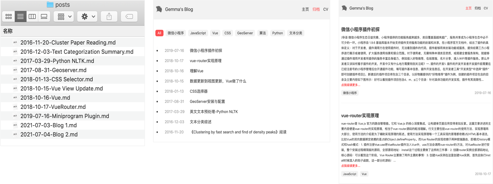

<!-- ---
title: Vue3.0搭建博客 (三)：文章评论，部署github
date: 2021-07-05
tags: Vue, Blog
--- -->

上两篇解释了如何从项目文件夹内读取markdown文件，渲染文章页面，并生成目录树，锚定页面。本篇主要解释的是如何在文章内添加评论，将整个博客项目部署到github，通过github.io进行访问。本系列其他文章：
* [Vue3.0搭建博客 (一)：读取文章列表，解析标题信息](https://zhangmingemma.github.io/#/post?file=2021-07-03-Blog%201)
* [Vue3.0搭建博客 (二)：文章html渲染, 抽取目录](https://zhangmingemma.github.io/#/post?file=2021-07-03-Blog%202)

博客源码github: [博客仓库地址](https://github.com/zhangmingemma/zhangmingemma.github.io)

## 1. 文章评论

我这边不太想用服务器那一套，不想自己做存储，所以使用的是凹凸实验室开发的`gitalk`评论体系，它的原理其实是在github仓库内根据`id`新增issue，发表的评论便是新增的issue回复。指引中关于使用方法，其实说明的已经非常清楚了，这里就不做赘述了~~~

gitalk: [gitalk源码与指引](https://github.com/gitalk/gitalk)
gitalk: [gitalk示例Demo](https://gitalk.github.io/)

## 2. 部署github

* 在`vue.config.js`配置根目录和`index.html`的文件路径：
  * 设置`publicPath`，是因为默认`build`后的文件内容全部防止在`dist`文件夹内，包含编译后的`js`文件、`css`文件、静态文件、`public`文件夹下的内容等，因此我们需要将线上环境的根目录指向`/dist`，这样`index.html`中引用的`js`和`css`的路径才是正确的。
  * 设置`indexPath`，是因为`build`后的`index.html`默认也是防止在`dist`文件夹内的，所以部署后访问自己的页面，需要是`zhangmingemma.github.io/dist`，太丑了，所以我们这边配置后将`index.html`放在最外层，可以直接访问
    ```javascript
    module.exports = {
        parallel: false,
        publicPath: process.env.NODE_ENV === "production" ? "/dist" : "/",
        indexPath: path.resolve(__dirname, 'index.html')
    }
    ```
* `vue-router`使用hash模式，而非history模式，原因是history模式的路由跳转，会向服务器重新发起页面请求，而GitHub Pages并没有提供服务器，所以我们需要使用hash模式
    ```javascript
    const router = createRouter({
        history: createWebHashHistory(),
        routes
    })
    ```
* 新建代码仓库`username.github.io`，将build后包含dist文件夹的代码`push`到仓库的`gh-pages`分支，之后就可以访问`https://username.github.io`，看到自己的博客了。
* 这里`markdown`中我有引用一些存储在`public/images`目录下的本地图片，在部署之后，markdown没有被webpack解析到内容，所以图片的路径并没有得到转换，访问的是域名根目录，我这里的处理方式是转换为线上地址，本地开发的时候配置代理来访问。如果大家有更好的处理方式可以评论告诉我。我的具体做法是
    ```markdown
    // 原来图片的引用路径
    

    // 修改后图片的引用路径
    
    ```

    本地开发时配置的代理是：
    ```
    username.github.io/dist/images http://127.0.0.1:8080/images 
    ```


